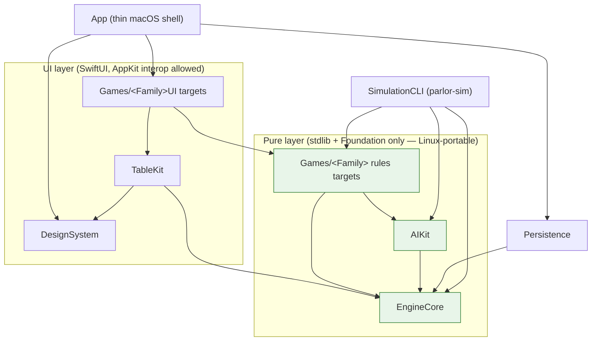
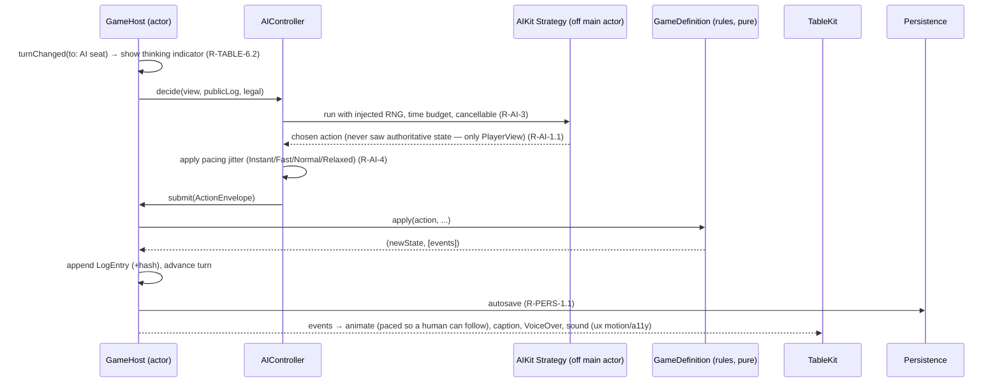

# Design — 01 Platform Foundation

This design realizes `requirements.md`. It is bounded by the steering documents (`product.md`, `tech.md`,
`structure.md`, `ux-guidelines.md`), which are authoritative; where a decision is load-bearing it is
recorded as an ADR (`Docs/ADR/`) and referenced here. Requirement IDs (`R-…`) are cited inline so every
design element traces to an acceptance criterion.

## 1. Module architecture

The package graph is the enforced dependency direction from `structure.md`. Arrows point in the allowed
direction (A → B means A depends on B). Lint fails on any edge not shown here (R-BUILD-1.4, R-BUILD-4.3).



- **Pure layer** (`EngineCore`, `AIKit`, rules targets) imports only the Swift standard library and
  Foundation — no SwiftUI/AppKit/SpriteKit/Combine — so it stays Linux-portable for a future server
  (`tech.md` rule 1; R-BUILD-4.3). `TableKit` may consume EngineCore **views and events only**, never
  authoritative state (`structure.md`; R-SESS-1.2).
- **`App/` is a thin shell**; nearly all logic lives in packages so `swift build`/`swift test` run
  headless (R-BUILD-1.2).

## 2. Core protocols and key types (Swift signatures)

Signatures are illustrative of the intended public surface; final names may be refined during
implementation but the shape and constraints are binding.

### 2.1 Components and identity (R-ENG-1)

```swift
/// A stable, opaque identity distinct from a piece's face value.
/// Two identical faces in a double deck have different PieceIDs. (R-ENG-1.2)
public struct PieceID: Hashable, Codable, Sendable { public let raw: UInt64 }

public enum Suit: String, Codable, Sendable, CaseIterable { case clubs, diamonds, hearts, spades }
public enum Rank: Int, Codable, Sendable, CaseIterable { case ace = 1, two, three, four, five, six,
    seven, eight, nine, ten, jack, queen, king }

public enum CardFace: Codable, Sendable, Hashable {
    case standard(Rank, Suit)
    case joker(index: Int)          // distinguishes the two jokers
}

public enum TileColor: String, Codable, Sendable, CaseIterable { case red, blue, black, orange }
public enum TileFace: Codable, Sendable, Hashable {
    case numbered(Int, TileColor)    // 1...13
    case joker(index: Int)
}

public struct Card: Identifiable, Codable, Sendable, Hashable {
    public let id: PieceID
    public let face: CardFace
}
public struct Tile: Identifiable, Codable, Sendable, Hashable {
    public let id: PieceID
    public let face: TileFace
}
```

Rank order, point values, and effective suit are **not** on these types; games supply them (R-ENG-1.3,
R-ENG-2.3):

```swift
/// Per-game semantics layered over faces, never baked into Card/Tile. (R-ENG-2.3)
public protocol CardSemantics: Sendable {
    func rankOrder(_ face: CardFace, context: TrumpContext?) -> Int
    func points(_ face: CardFace) -> Int
    func effectiveSuit(_ face: CardFace, context: TrumpContext?) -> Suit?   // e.g. left bower
}
```

### 2.2 Deck/set definitions as data (R-ENG-2)

```swift
public struct DeckDefinition: Codable, Sendable {
    public let id: String                 // "standard-52", "spider-104", "tile-rummy-106", ...
    public let faces: [CardFace]          // or a TileFace variant for tile sets
    public var count: Int { faces.count }
    // Composition tests assert exact multiset per R-ENG-2.2.
}
```

### 2.3 Zones and visibility (R-ENG-3)

```swift
public enum Visibility: Codable, Sendable {
    case hidden                 // no one sees contents or identities
    case ownerOnly              // only the owning seat
    case publicAll              // everyone sees identities
    case topCardOnly            // only the top piece's identity is public
    case perPieceFaceState      // each piece carries its own faceUp/faceDown
}

public struct ZoneID: Hashable, Codable, Sendable { public let name: String; public let owner: SeatID? }

public struct Zone: Codable, Sendable {
    public let id: ZoneID
    public var visibility: Visibility
    public var contents: [PieceID]                 // ordered
    public var faceUp: Set<PieceID>                 // used by perPieceFaceState / topCardOnly
}
```

### 2.4 RNG and shuffle (R-ENG-4; ADR 0002)

```swift
/// Deterministic PRNG documented in ADR 0002 (SplitMix64 seed → xoshiro256**).
public struct SeededRNG: RandomNumberGenerator, Sendable {
    public init(seed: UInt64)
    public mutating func next() -> UInt64
}

public enum Shuffle {
    /// Our own Fisher–Yates; rules code must use this, never `shuffle()`. (R-ENG-4.2)
    public static func fisherYates<T>(_ items: inout [T], using rng: inout SeededRNG)
}
```

### 2.5 GameDefinition (R-ENG-5)

```swift
public struct GameMetadata: Codable, Sendable {
    public let id: String                 // stable kebab-case (structure.md): "klondike", "crazy-eights"
    public let name: String
    public let family: GameFamily
    public let seatRange: ClosedRange<Int>
    public let typicalDuration: DurationRange
    public let complexity: Complexity
}

public protocol GameDefinition: Sendable {
    associatedtype State: GameState
    associatedtype Action: GameAction
    associatedtype Options: GameOptions

    static var metadata: GameMetadata { get }
    static var optionsSchema: OptionsSchema<Options> { get }        // defaults + presets (R-ENG-5.2)

    func initialState(options: Options, seed: UInt64) -> State       // (R-ENG-5.3)
    func phase(of state: State) -> Phase
    func legalActions(for seat: SeatID, in state: State) -> [Action] // (R-ENG-5.3)

    /// Returns new state + events, or a typed violation with a human-readable reason. (R-ENG-5.4)
    func apply(_ action: Action, by seat: SeatID, to state: State)
        -> Result<(State, [GameEvent]), RuleViolation>

    func isTerminal(_ state: State) -> Bool                          // (R-ENG-5.5)
    func outcome(_ state: State) -> HandOutcome
    func redactedView(of state: State, for viewer: Viewer) -> PlayerView   // (R-ENG-8)
    var undoPolicy: UndoPolicy { get }                               // (R-ENG-7.3)
}

public struct RuleViolation: Error, Codable, Sendable {
    public let code: String
    public let reason: String   // human-readable, drives the spring-back caption (R-TABLE-4.1)
}
```

`GameState`/`GameAction`/`GameOptions`/`PlayerView`/`GameEvent`/`HandOutcome` are all `Codable & Sendable`
and schema-versioned (R-ENG-8.5). Conforming to `GameDefinition` (plus AI, layout, rules doc, catalog
entry) is the **entire** contribution of a new game (R-ENG-5.6; §11).

### 2.6 Events (R-ENG-8.1)

```swift
public enum GameEvent: Codable, Sendable {
    case dealt(pieces: [PieceMoveDescriptor])
    case pieceMoved(PieceMoveDescriptor)
    case pieceRevealed(token: ViewToken, identity: PieceID)   // binds token → identity (R-ENG-8.4)
    case pieceFlipped(PieceID, faceUp: Bool)
    case turnChanged(to: SeatID)
    case trickWon(by: SeatID)
    case scoreChanged(seat: SeatID, delta: Int, total: Int)
    case handEnded(HandOutcome)
    case suitNamed(Suit, by: SeatID)          // Crazy Eights 8s (R-CE-2.2)
    case captioned(LocalizedKey)              // narration for the caption bar (ux table conventions)
}
```

One event stream feeds animation, captions, VoiceOver, sound, and the log (R-ENG-8.1).

### 2.7 Action log and match (R-ENG-6, R-ENG-7)

```swift
public struct LogEntry: Codable, Sendable {
    public let index: Int
    public let seat: SeatID
    public let action: AnyGameAction        // type-erased, schema-versioned
    public let resultingStateHash: StateHash
    public let metadata: LogMetadata        // timestamps live ONLY here (tech.md rule 8)
}

public struct Match: Codable, Sendable {
    public var handSeeds: [UInt64]          // one seed recorded per hand (R-ENG-4.3)
    public var dealer: SeatID
    public var cumulativeScores: [SeatID: Int]
    public var target: EndCondition
    public var handSummaries: [HandSummary] // (R-ENG-6.3)
}

public enum UndoPolicy: Codable, Sendable {
    case unlimited                          // Solitaire (R-ENG-7.3)
    case none                               // multi-seat default (R-ENG-7.3)
    case practiceMode                       // undo last action, roll back & re-decide AI; no stats (R-ENG-7.4)
}
```

### 2.8 Views / redaction and tokens (R-ENG-8.2–8.4)

```swift
public enum Viewer: Codable, Sendable {
    case seat(SeatID)
    case spectator
    case debugOmniscient        // debug-only; never used in shipping redaction paths
}

/// An opaque placeholder for a piece hidden from a viewer. Unique per view so it cannot be
/// correlated across views to recover a hidden identity. (R-ENG-8.3, R-QA-3)
public struct ViewToken: Codable, Sendable, Hashable { public let opaque: UInt64 }

public enum ViewPiece: Codable, Sendable {
    case known(Card)            // or Tile, per family
    case hidden(ViewToken)
}

public struct PlayerView: Codable, Sendable {
    public let viewer: Viewer
    public let zones: [ZoneView]      // each piece is .known or .hidden
    public let scores: [SeatID: Int]
    public let phase: Phase
    public let legalActions: [AnyGameAction]   // only for the viewer's own seat
}
```

**Token model.** For a given viewer, each hidden `PieceID` maps to a fresh `ViewToken` drawn from a
per-view keyed permutation (keyed by viewer + a per-view salt). Because the salt differs per view and per
regeneration, tokens cannot be joined across two views to deanonymize a piece. A `pieceRevealed` event
carries `(token, identity)` so the client can rebind the on-screen node and keep the flip animation
continuous (R-ENG-8.4). This is the property asserted by the view-leak test (R-QA-3.1).

### 2.9 Session, host, controllers, transport (R-SESS-1..R-SESS-4)

```swift
public actor GameHost {                                   // sole mutator of state (R-SESS-1.1)
    public init<G: GameDefinition>(game: G, options: G.Options, seats: [SeatBinding], seed: UInt64)
    public func submit(_ envelope: ActionEnvelope) async -> ResultEnvelope   // accepted/rejected
    public func view(for viewer: Viewer) async -> PlayerView
    public func events(since index: Int) async -> [GameEvent]
}

public protocol PlayerController: Sendable {              // async seam (R-SESS-2.1)
    func decide(view: PlayerView, publicLog: [PublicLogEntry], legal: [AnyGameAction]) async -> AnyGameAction
}
public struct LocalHumanController: PlayerController { /* driven by UI intents (R-SESS-2.2) */ }
public struct AIController: PlayerController { /* wraps an AIKit Strategy (R-SESS-2.2) */ }
// RemoteController: NOT implemented here; see §3 note (R-SESS-2.3).

/// Codable envelope used exactly as a network client would use it (R-SESS-4).
public enum ClientMessage: Codable, Sendable { case submit(ActionEnvelope), requestView(Viewer) }
public enum HostMessage: Codable, Sendable {
    case result(ResultEnvelope), viewUpdate(PlayerView), events([GameEvent])
}
public protocol Transport: Sendable {                     // in-process now, network later (R-SESS-4.2)
    func send(_ msg: ClientMessage) async -> HostMessage
}
```

**Turn models (R-SESS-3).** The host's turn loop supports: *sequential* (await one seat), *simultaneous*
(await all required seats, then resolve as one transition), and *out-of-turn windows* (a bounded window in
which specific seats may act). Each carries an optional timeout; default none (R-SESS-3.4). The loop only
ever `await`s a `PlayerController`, so a `RemoteController` slots in unchanged (R-SESS-2.4).

**RemoteController seam (documented, not built).** A future `RemoteController` would implement
`PlayerController.decide` by serializing the `PlayerView`/legal actions over a network `Transport` to a
remote seat and awaiting a `ClientMessage.submit`. Because the local UI already round-trips through
`Transport` + `ClientMessage`/`HostMessage`, no host, rules, or UI restructuring is required — only a new
`Transport` conformance. No networking code is written in this spec (R-SESS-2.3; `product.md` non-goals).

**Concurrency (R-SESS-6).** No `static`/singleton game state. Each session is an independent `GameHost`
actor instance; two windows and `parlor-sim` can run simultaneously.

## 3. Sequence diagrams

### 3.1 A human drags a card (input → host → rules → events → animation/caption/VoiceOver/sound → autosave)

```mermaid
sequenceDiagram
    participant U as User
    participant TK as TableKit (view)
    participant LH as LocalHumanController
    participant T as Transport (in-process)
    participant H as GameHost (actor)
    participant G as GameDefinition (rules, pure)
    participant P as Persistence
    U->>TK: drag Card to target zone
    TK->>TK: highlight legal targets while dragging (R-TABLE-3.6)
    TK->>LH: intent(move piece → zone)
    LH->>T: ClientMessage.submit(ActionEnvelope)
    T->>H: submit(envelope)
    H->>G: apply(action, by: seat, to: state)
    alt legal
        G-->>H: (newState, [events])
        H->>H: append LogEntry (+state hash), advance turn
        H-->>T: ResultEnvelope.accepted + events
        H->>P: autosave after accepted action (R-PERS-1.1)
        T-->>TK: HostMessage.events([...])
        TK->>TK: enqueue on animation queue; play move/flip; honor speed; fast-forwardable (R-TABLE-5)
        TK->>TK: caption from event; VoiceOver announce; sound cue (R-ENG-8.1, ux sound/a11y)
    else illegal
        G-->>H: RuleViolation(reason)
        H-->>T: ResultEnvelope.rejected(reason)
        T-->>TK: HostMessage.result(rejected)
        TK->>U: spring back + shake + caption from reason; no dialog (R-TABLE-4.1)
    end
```

### 3.2 An AI takes a turn (same pipeline; AI is just another controller)



Both flows are identical from `submit` onward, which is what makes the architecture multiplayer-ready
(R-SESS-1, R-SESS-4).

## 4. Save-file schema (R-PERS-1, R-PERS-2, R-ENG-8.5)

The save is a versioned, `Codable` document. Restore replays the log against the recorded seeds, so restore
+ continue equals an uninterrupted run (R-QA-4.1). Statistics/settings live in the sandbox container, no
cloud (R-PERS-3.1).

```jsonc
{
  "schemaVersion": 3,                     // bumped on any format change; migrations tested (R-PERS-2.1)
  "gameID": "crazy-eights",               // stable kebab-case (structure.md)
  "createdAt": "…", "updatedAt": "…",     // metadata only (tech.md rule 8)
  "options": { /* game options snapshot */ },
  "match": {
    "handSeeds": [ 1234567890, … ],       // one seed per hand (R-ENG-4.3)
    "dealer": "seat-2",
    "cumulativeScores": { "seat-0": 34, "seat-1": 12 },
    "target": { "kind": "targetScore", "value": 100 },
    "handSummaries": [ … ]
  },
  "seats": [ { "id": "seat-0", "profile": {…}, "controller": "localHuman" },
             { "id": "seat-1", "profile": {…}, "controller": "ai", "persona": "cautious", "difficulty": "medium" } ],
  "actionLog": [
    { "index": 0, "seat": "seat-1", "action": {…}, "resultingStateHash": "…", "metadata": {…} }
  ],
  "cursor": 42                            // last applied log index; resume point (R-PERS-1.2)
}
```

**Migration.** A registry maps `schemaVersion n → n+1` transforms; loading an older save runs the chain.
IF decoding fails or the version is unknown/incompatible, THEN the loader returns a typed failure; the app
shows a non-modal notice and discards the save, never crashing (R-PERS-2.2). Migration and
corrupted/incompatible paths have tests.

## 5. AI architecture (R-AI-1..R-AI-6)

- **Information barrier.** A `Strategy` is handed only `(PlayerView, publicLog, legal)`; there is no path
  to authoritative `State`. This is enforced by types, not convention (R-AI-1.1), and verified indirectly
  by the view-leak test (R-QA-3).
- **Toolkit** (`AIKit`): `DeterminizationSampler` (samples hidden info consistent with all observations,
  including inferred suit voids), `MonteCarlo` rollouts, `ISMCTS`, and `Evaluator` helpers (R-AI-2.2).
- **Tiers.** `Easy`/`Medium`/`Hard` conform to a common `Strategy` protocol per game (R-AI-2.1). Crazy
  Eights: Easy = random legal + dump 8s early (R-CE-5.1); Medium = hoard 8s, name longest suit, track
  opponent voids (R-CE-5.2); Hard = determinized Monte Carlo (R-CE-5.3).
- **Execution.** Decisions run off the main actor via a cancellable `Task` under a time budget; the RNG is
  injected for reproducible AI-vs-AI (R-AI-3). Pacing jitter (Instant/Fast/Normal/Relaxed) is applied by
  `AIController` and is independent of animation speed (R-AI-4).
- **Personas.** Named personas carry an avatar + style parameters (aggression, risk tolerance) that bias
  the evaluator (R-AI-5).
- **Hints.** `hint(view:) -> (action, explanation)` returns a suggested action plus a short plain-language
  reason; coach mode reuses the same call (R-AI-6).

## 6. Rendering approach and performance (R-TABLE-*, R-NFR-PERF; ADR 0001)

- **SwiftUI-first** table: cards/tiles are lightweight views with **stable identity** and matched
  geometry for motion; identity continuity across a reveal is preserved by rebinding on `pieceRevealed`
  (R-TABLE-1.3, R-ENG-8.4). Full rationale and the fallback rule are in **ADR 0001**.
- **Cached vector faces.** Faces/backs are drawn as vectors and cached as images keyed by
  `(theme, face, scale, appearance)`; never redrawn per frame (R-TABLE-2.1). A card's shadow scales with
  its lift height (`ux-guidelines.md` visual language).
- **Shaders for materials.** Felt fiber/vignette, wood, sheen use Metal shaders through SwiftUI's shader
  APIs (R-TABLE-1.3). SpriteKit is allowed only for particle/physics overlays like the win celebration
  (`tech.md` rendering).
- **Animation queue.** Sequences events, honors the speed setting, fast-forwards on click/keypress, and
  never blocks input longer than the animation currently playing (R-TABLE-5). Reduce Motion → crossfades,
  no parallax/particles (R-TABLE-5.3).
- **Budgets.** Meets R-NFR-PERF (≤ 1.5 s launch, ≥ 60 fps incl. 104-card layouts, ≤ 50 ms input feedback,
  ≤ 400 MB). A **104-card stress scene** (R-TABLE-7.2) is the profiling harness. IF profiling shows SwiftUI
  cannot meet a budget, THEN work stops and an ADR with benchmark data is written before changing approach
  (`tech.md` rendering; recorded as the trigger in ADR 0001).

## 7. Theme-pack manifest format (R-DS-2, R-DS-4)

A theme pack is a folder under `Assets/ThemePacks/<id>/` with a JSON manifest plus vector assets and audio,
loaded at runtime and switchable without restart (R-DS-4.1). Placeholders are flagged in `tasks.md`
(R-DS-4.2, R-DS-6).

```jsonc
{
  "schemaVersion": 1,
  "id": "walnut-parlor",
  "displayName": "Walnut Parlor",
  "table": {
    "material": "wood",                 // maps to a procedural shader (R-DS-2.1)
    "feltColorToken": "felt.walnut",
    "railShader": "wood.polished",
    "vignette": 0.35
  },
  "decks": {
    "styles": ["classic", "modern", "four-color", "jumbo-index"],   // (R-DS-3.1)
    "backs": ["lattice", "art-deco", "linen", "checker", "wave", "crest"]  // ≥ 6 (R-DS-3.2)
  },
  "assets": { "kind": "vector", "path": "vector/" },
  "audio": { "shuffle": ["shuffle_a.caf","shuffle_b.caf"], "deal": [...], "flip": [...],
             "place": [...], "chips": [...], "win": [...] },   // randomized variations (R-DS-5.1)
  "placeholder": true                    // "needs production art" flag surfaces in Settings + tasks.md
}
```

Semantic color tokens (light/dark chrome) come from DesignSystem and meet WCAG 2.2 AA (R-DS-1); table
themes are independent of system appearance (R-DS-2.2).

## 8. Testing strategy (R-QA-*, R-NFR-*)

- **Scenario tests** (Swift Testing `@Test`/`#expect`), Given/When/Then, one per rule/option in
  `Docs/Rules/klondike.md` and `Docs/Rules/crazy-eights.md`, named after the rule they prove
  (`structure.md`) and traceable to the doc (R-QA-1).
- **`parlor-sim`** runs AI-vs-AI and random-legal games checking invariants every step: piece
  conservation, only-legal-actions, bounded length, scoring consistency, deterministic replay
  (seed + log → identical final hash) (R-QA-2.1). `make test` = 500 games/game; `make test-long` = 10,000
  (R-QA-2.2).
- **View-leak property test**: for random states × every viewer, the serialized view contains no hidden
  identity (R-QA-3).
- **Save/restore round-trip**: restore at random log indices and continue → identical outcome to an
  uninterrupted run with the same seeds (R-QA-4).
- **UI tests** (XCUITest): library → setup → Klondike via drag *and* keyboard → undo → win from a debug
  near-win seed; a full Crazy Eights hand vs AI; theme/deck change; quit & resume (R-QA-5). Accessibility:
  keyboard-only completion of both games + XCUITest accessibility audits on library/setup/table
  (R-A11Y-5).
- **Performance tests** (XCTest metrics): launch, deal animation, AI decision time vs `tech.md` budgets
  (R-QA-6).
- **Coverage** ≥ 90% for EngineCore and each rules target (R-QA-7).

## 9. Accessibility design (R-A11Y-*)

VoiceOver labels/values/hints are derived from the same `GameEvent`/`PlayerView` data that drives visuals,
so they can never drift (e.g. "Queen of clubs, trump, playable"); custom rotors expose hands and piles;
opponent actions and results are announced (R-A11Y-1). Keyboard navigation moves focus between zones and
pieces with a visible focus ring, and every action (select/place/cancel/smart-move) has a key path
(R-A11Y-2, R-TABLE-3.4). Suits always carry shapes and a Four-Color deck is available (R-A11Y-3). The app
respects Reduce Motion / Reduce Transparency / Increase Contrast and offers card sizes S/M/L/XL
(R-A11Y-4).

## 10. App shell (R-APP-*)

Standard SwiftUI chrome (toolbars, sidebars, sheets, menus, Settings) so the app inherits the current
macOS design language; custom richness stays on the table (`ux-guidelines.md` platform). Library with
Continue hero, family groups, filters, favorites, recently played, and a feature-flagged catalog so
unbuilt games don't appear (R-APP-1). Setup sheet (presets first, options + house rules grouped, opponent
setup, remember choices) (R-APP-2). Table screen with in-place rules inspector rendered from
`Docs/Rules/<game-id>.md` (R-APP-3). Statistics via Swift Charts with confirm-on-reset (R-APP-4). Settings
groups per R-APP-5. Menu bar/shortcuts, full screen, window restoration, multi-window independent games,
About with third-party notices (R-APP-6). ≤ 3-step skippable first-run tour (R-APP-7).

## 11. How to add a new game (checklist for Specs 2–8)

A new game is **game-specific modules only** (R-ENG-5.6; `structure.md`). Follow the fixed folder shape
`Rules/`, `AI/`, `Layout/`, `Tutorial/`, `Tests/`:

1. **Rules** — add `Packages/Games/<Family>/Rules/`: conform to `GameDefinition` (metadata with a stable
   kebab-case id, options schema + presets, initial state from seed, phases, `legalActions`, `apply`
   returning events or `RuleViolation`, terminal/outcome, redaction, undo policy).
2. **Deck/set** — if a new composition is needed, add a `DeckDefinition` + composition test (R-ENG-2);
   supply `CardSemantics` (rank order, points, effective suit) — do not touch `Card`/`Tile`.
3. **AI** — add `AI/`: Easy/Medium/Hard `Strategy` conformances using the AIKit toolkit; provide a hint.
4. **Layout** — add `Layout/`: a declarative zone→table layout (positions, stacking/fanning, seat
   arrangement, responsive rules). No custom animation code (R-TABLE-1.2).
5. **Rules doc** — author `Docs/Rules/<game-id>.md` (original writing): every option, default, presets;
   mark uncertain rules NEEDS REVIEW (`product.md` DoD).
6. **Catalog** — register behind a feature flag so it appears in the Library when ready (R-APP-1.2).
7. **Tests** — scenario tests per rule/option; wire the game into `parlor-sim` (R-QA-2); confirm
   view-leak, save/restore, coverage.
8. **Tutorial** — scripted deals + coach mode reusing the hint interface (R-AI-6).
9. **Docs upkeep** — update `Docs/Architecture.md`; **IF** the game needed any EngineCore/TableKit change,
   **write an ADR** first (`tech.md` rule 9; R-ENG-5.6; R-NFR-DOC.2).

## 12. Related documents

- `Docs/Architecture.md` — living architecture overview (this design is its spec-time source).
- `Docs/ADR/0001-rendering-approach.md` — SwiftUI-first rendering, caching, shader use, fallback trigger.
- `Docs/ADR/0002-rng-and-determinism.md` — PRNG algorithm, Fisher–Yates, seed handling, state hash.
