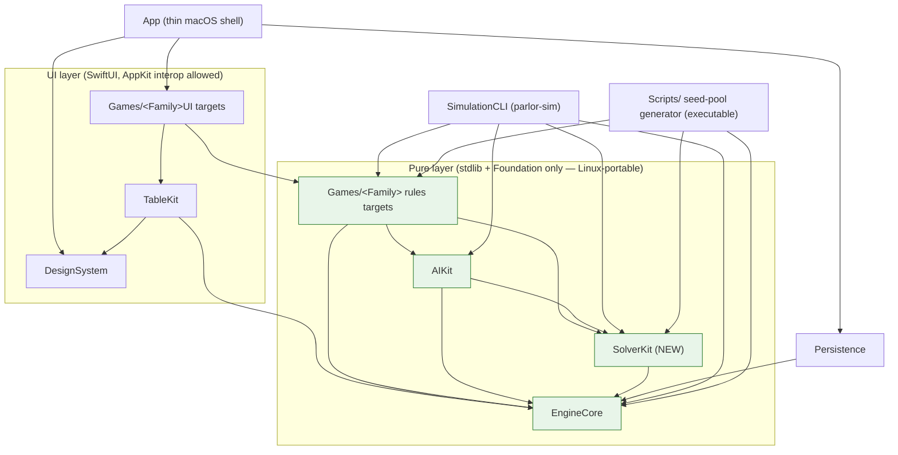

# Design — 02 Solitaire Collection

This design realizes `requirements.md`. It is bounded by the steering documents (`product.md`, `tech.md`,
`structure.md`, `ux-guidelines.md`), which are authoritative; where a decision is load-bearing it is
recorded as an ADR (`Docs/ADR/`) and referenced here. Requirement IDs (`R-…`) are cited inline so every
design element traces to an acceptance criterion. This spec **reuses** `EngineCore`, `AIKit`, and
`TableKit` exactly as they stand after Spec 1 and **retrofits** Klondike; Spec 1 IDs are referenced, never
renumbered. Where a rule is genuinely undecided it is left **NEEDS REVIEW**, consistent with the matching
`Q2-*` Open Question rather than guessed.

The four new games (`spider`, `freecell`, `pyramid`, `tri-peaks`) and the Klondike retrofit are added as
**game-specific modules plus one new pure package for the shared solver** (R-SETUP2-1.1). The only
architectural change is the introduction of `Packages/SolverKit` (§1), recorded in **ADR 0003**. **No
`EngineCore` or `TableKit` public API changes** — the entire spec is designed around the Spec 1 public
surfaces (R-SETUP2-1.3, R-SOLVER-2.1). See §11 for the explicit statement of what does and does not need an
ADR.

## 1. Module placement and package graph

### 1.1 Decision: a new pure package `Packages/SolverKit`

The solver must be usable by the Games rules targets (hints, R-KLON2-1), the `Scripts/` seed-pool
generator (R-WINNABLE-1), `SimulationCLI` (R-QA2-3, R-QA2-4), and possibly `AIKit`; it must be **pure**
(stdlib + Foundation only) so it is Linux-portable (R-SOLVER-2.1, `tech.md` rule 1). Placing it inside
`AIKit` would force every consumer to depend on the whole multi-seat AI toolkit it does not use and would
blur responsibilities. Therefore the solver lives in a **new pure package `Packages/SolverKit`** that
depends only on `EngineCore` and consumes only public `GameDefinition`/state/action surfaces. This resolves
**Q2-7** and finalizes **Assumption A2-11**. The tradeoff analysis and the enforced-dependency-direction
impact are recorded in **ADR 0003**.

`SolverKit` needs **no `EngineCore`/`TableKit` public-API change** (R-SETUP2-1.3): it reads initial state
via `GameDefinition.initialState(options:seed:)`, enumerates moves via `legalActions(for:in:)`, applies
them via `apply(_:by:to:)`, and detects wins via `isTerminal`/`outcome` — all Spec 1 public surface
(R-ENG-5). It reuses the ADR-0002 `SeededRNG` + Fisher–Yates and the canonical state-hash discipline.

### 1.2 Updated dependency diagram (to be applied to `Docs/Architecture.md`)

Introducing `SolverKit` changes the layered module map. The `tasks.md` feature will apply the edit to
`Docs/Architecture.md` and the lint dependency-direction allow-list in the same task (R-NFR-DOC.1,
R-SOLVER-2.2); the intended diagram is shown here so the change is unambiguous. New nodes/edges are marked
with comments.



**Required `Docs/Architecture.md` update (specified, applied in `tasks.md`):**

- Add the `SolverKit` node and the edges `SolverKit → EngineCore`, `GamesRules → SolverKit`,
  `AIKit → SolverKit`, `SimulationCLI → SolverKit` to the layered module map mermaid block.
- Add one module description line: *"`SolverKit` — pure deal solver (winnable / unwinnable / unknown) for
  the solitaire family; depends only on `EngineCore`; used by rules targets, AIKit, `SimulationCLI`, and
  the `Scripts/` seed-pool generator."*
- Update the lint dependency-direction allow-list to add exactly the four edges above and no others
  (`SolverKit` must **not** depend on `AIKit`, keeping the graph acyclic).
- Add ADR 0003 to the "Architecture Decision Records" list.

`SolverKit` slots into the same pure tier as `EngineCore`/`AIKit`, so the layering invariant (UI never in
the pure layer) is preserved (R-SOLVER-2.1).

## 2. Solver architecture and data structures (R-SOLVER-1, R-SOLVER-3, R-NFR-SOLVER)

### 2.1 Public surface (Swift signatures)

Signatures are illustrative of the intended public surface; names may be refined in implementation but the
shape and constraints are binding.

```swift
/// Three-valued classification. `unknown` means the budget was exhausted before a proof either way.
/// (R-SOLVER-1.1)
public enum SolveResult: Codable, Sendable, Equatable {
    case winnable(bestFirstMove: SolverMove?)   // a winning line exists; bestFirstMove when known (R-SOLVER-1.3)
    case unwinnable                             // proven: no winning line exists
    case unknown                                // budget exhausted; neither proven (R-NFR-SOLVER.1)
}

/// A game-agnostic move handle the solver can surface as a hint; maps back to a concrete GameAction
/// through the per-game adapter (§2.3). (R-SOLVER-1.3, R-KLON2-1.2)
public struct SolverMove: Codable, Sendable, Equatable { public let encoded: AnyGameAction }

/// Deterministic budget. A timeout is modeled primarily as a node/iteration cap so results are
/// reproducible across machines and runs; the optional wall-clock is a safety valve only and, when it
/// fires, yields `.unknown` deterministically because `maxNodes` is the authoritative bound.
/// (R-SOLVER-1.4, R-NFR-SOLVER.3, A2-10)
public struct SolveBudget: Codable, Sendable {
    public var maxNodes: Int              // authoritative deterministic cap
    public var maxDepth: Int?             // optional; used by iterative deepening
    public var wallClock: Duration?       // optional safety valve; never the sole determinant
    public static let interactive: SolveBudget  // ≤ 1.0 s p95 path (R-NFR-SOLVER.1; default NEEDS REVIEW, Q2-11)
    public static let generation: SolveBudget   // larger offline cap (R-NFR-SOLVER.2; default NEEDS REVIEW, Q2-11)
}

/// A game the solver understands. Each solitaire supplies one conformance in SolverKit (or its rules
/// target), built entirely on the public GameDefinition surface — no engine API change. (R-SOLVER-2.1)
public protocol SolvableGame: Sendable {
    associatedtype Node: SolverNode                 // compact search-state encoding (§2.4)
    func rootNode(from state: Self.EngineState) -> Node
    func canonicalHash(_ node: Node) -> UInt64       // ADR-0002 discipline: stable ordering, no wall-clock (R-SOLVER-3.1)
    func isWon(_ node: Node) -> Bool
    func isDead(_ node: Node) -> Bool                // proven-unwinnable local test (§2.6)
    func generateMoves(_ node: Node, into out: inout [SolverMove]) // ordered (§2.5)
    func apply(_ move: SolverMove, to node: Node) -> Node
    func heuristic(_ node: Node) -> Int              // admissible-ish progress estimate for best-first ordering
}

/// The service. Deterministic: same deal + same budget ⇒ same result (R-SOLVER-1.4).
/// Runs off the main actor and is cancellable when used for an interactive hint (R-SOLVER-3.3).
public struct DealSolver: Sendable {
    public init<G: SolvableGame>(game: G)
    public func solve(_ state: G.EngineState, budget: SolveBudget) -> SolveResult
    public func solve(_ state: G.EngineState, budget: SolveBudget) async -> SolveResult  // cancellable wrapper
}
```

Determinism (R-SOLVER-1.4, R-NFR-SOLVER.3): the search order, move ordering, and transposition eviction
are all functions of the node encoding and the budget only — never of wall-clock time, `Set` iteration
order, or address identity. The optional `wallClock` is a non-authoritative safety valve; because
`maxNodes` bounds the search deterministically, a run that hits the node cap returns `.unknown`
identically on every machine (A2-10).

### 2.2 Search paradigm per game

- **FreeCell, Klondike, Spider** — *building* solitaires with large branching and cycles. Use
  **iterative-deepening depth-first search (IDDFS) with a transposition table** keyed by
  `canonicalHash` (R-SOLVER-3.1, A2-9). Best-first move ordering (§2.5) is applied within each depth
  bound so promising lines are explored first; the transposition table prevents re-expanding a
  canonically equal state and lets the search **prove unwinnable** when the reachable state space is fully
  enumerated within budget (all frontier nodes are dead or already visited). Iterative deepening bounds
  memory (only the current path plus the table) and yields a natural node counter for the deterministic
  budget.
- **Pyramid, TriPeaks** — *targeted* removal solitaires with much smaller reachable state spaces. Use a
  **best-first / A\*-style bounded search** over the compact node encoding (§2.4) with the same
  transposition table. Because the state space is small, these frequently reach a definitive
  `winnable`/`unwinnable` verdict well inside the interactive budget.

All five reuse the same `DealSolver` driver and transposition table; only the `SolvableGame` conformance
differs. A `winnable` verdict records the first move of the discovered line so the hint path can surface a
**best next move** (R-SOLVER-1.3, R-KLON2-1.2).

### 2.3 State intake — public surface only (R-SOLVER-2.1, R-SETUP2-1.3)

The solver never touches authoritative `GameHost` state. Each `SolvableGame` builds its `rootNode` from
the deal produced by `GameDefinition.initialState(options:seed:)` (R-ENG-5.3) and, when it needs to expand
a move it cannot represent internally, can round-trip through the game's public `apply`. In practice the
per-game node encoding (§2.4) is a compact projection that the adapter keeps in sync with the public
rules, so the hot loop stays in `SolverKit` without engine calls. This is why the solver requires **no
`EngineCore`/`TableKit` public-API change**.

### 2.4 Compact per-game state encoding (`SolverNode`)

Encodings are chosen for cheap hashing and cheap move application; each stores only what the rules can
observe (no hidden-identity leakage, consistent with R-ENG-8 redaction — the solver runs on a fully-known
solo deal, so redaction is trivial for these solo games, R-SETUP2-1.4).

- **FreeCell** (`R-FREECELL-1`): 8 tableau columns as small arrays of card codes (`suit*13 + rank`,
  0…51), 4 free-cell slots (card code or empty), 4 foundation tops (one rank per suit). ~64 bytes.
- **Klondike**: 7 tableau columns (face-down count + face-up card codes), stock+waste as an ordered list
  with a cursor, 4 foundation tops, and the draw-count/pass state (Draw 1/3 from R-KLON) as part of the
  node so the solver honors the option variant (R-KLON2-2.3).
- **Spider** (`R-SPIDER`): 10 columns (face-down count + face-up card codes), stock remaining count, a
  count of completed runs, and the suit-count variant (1/2/4). Because Spider is dealt from `spider-104`
  (R-SPIDER-1.1), codes range 0…103 with suit reduced per A2-2.
- **Pyramid** (`R-PYR`): a 28-bit mask of which pyramid slots remain, plus stock/waste cursors and the
  redeal counter. Exposure (R-PYR-1.3, R-PYR-2.5) is derived from the mask, not stored.
- **TriPeaks** (`R-TRIP`): a 28-bit peak-remaining mask, the current-card code, the stock cursor, and the
  wrap option flag (R-TRIP-2.2). Streak state is **not** part of the solver node (scoring does not affect
  winnability, R-TRIP-4).

### 2.5 Move generation and ordering (R-SOLVER-3.1)

`generateMoves` enumerates only legal moves for the node, matching the per-game rules in §7. Ordering
biases the search toward progress and toward provably-safe reductions first:

1. **Forced/auto moves first.** Spider run auto-collect (R-SPIDER-3.1), Klondike/FreeCell **safe**
   foundation autoplay (R-FREECELL-3.1 reusing the Spec 1 R-KLON-3.2 "Safe" definition), and Pyramid
   King-alone/sum-to-13 removals that cannot block progress. These are applied deterministically and do
   not branch when provably safe, shrinking the tree.
2. **Foundation/removal moves** that increase the completed count.
3. **Tableau/sequence moves** ordered by heuristic gain (e.g. exposing a face-down card, emptying a
   column). For FreeCell supermoves the largest legal unit move (subject to §7.2 capacity) is preferred.
4. **Reversible cell/stock moves last** (free-cell parks, stock draws), since they rarely make progress
   alone.

To reduce symmetry, **equal empty tableau columns are treated as interchangeable** (only one empty-column
destination is expanded), and in Spider/FreeCell **suit symmetry among identical foundation states** is
collapsed by the canonical hash (§2.7). This is the symmetry reduction referenced in §2.6.

### 2.6 Pruning and dead-state detection (R-SOLVER-3.1)

- **Transposition pruning:** never expand a node whose `canonicalHash` is already in the table at an equal
  or greater remaining budget.
- **`isDead` local proofs:** e.g. Pyramid/TriPeaks with no legal removal, no draw, and no redeal remaining
  (R-PYR-4.2, R-TRIP-3.2); FreeCell/Spider with all cells/stock exhausted and no productive move. A dead
  node contributes an `unwinnable` proof for its subtree.
- **Symmetry reduction:** equal empty columns and interchangeable suits (§2.5) collapse duplicate
  branches.
- **Verdict logic:** `winnable` as soon as any line reaches `isWon`; `unwinnable` only when the search
  exhausts the reachable, non-dead state space **within budget** (every frontier node is won → no, dead,
  or already-visited); otherwise, when `maxNodes` is hit, `unknown` (R-SOLVER-1.1, R-SOLVER-3.2). The
  cross-check tests (§9) guarantee `winnable` is never returned for a provably-unwinnable deal and
  `unwinnable` is never returned for a provably-winnable deal (R-SOLVER-3.2, R-QA2-3.1).
- **Feasibility of `unwinnable` by exhaustion.** Exhausting the reachable, non-dead state space within a
  bounded node budget is genuinely reachable for the *removal* solitaires (Pyramid, TriPeaks) with their
  28-bit masks and small state spaces. For the *building* solitaires (FreeCell, Spider, Klondike) the
  reachable space is far too large to exhaust at any tractable node cap, so those deals in practice return
  `winnable` or `unknown` and only rarely a proven `unwinnable`; the curated #11982 fixture
  (R-FREECELL-4.4) is a known-answer anchor, not evidence that general unwinnability proofs scale on
  building solitaires. This is acceptable because the winnable-pool pipeline (§4) consumes only `winnable`
  and the hint path (§6) falls back to the heuristic on `unknown`.

### 2.7 Canonical hashing (ADR 0002 discipline)

`canonicalHash` produces a 64-bit digest over a **canonical serialization** of the node: columns sorted by
a stable key (so equal empty columns and reorderable equal columns collapse), foundations in fixed suit
order, and no wall-clock or address-derived fields (ADR 0002 §4 discipline; R-SOLVER-3.1). The digest uses
a fixed mixing function (e.g. a fixed-seed SplitMix64/FNV-style fold) so it is stable across runs and
platforms. This is the same "stable ordering, no wall-clock" rule the engine uses for its `StateHash`; the
solver's table therefore inherits reproducibility.

### 2.8 Execution model (R-SOLVER-3.3, R-NFR-SOLVER)

For an **interactive hint**, `DealSolver.solve(_:budget:) async` runs on a background task, is cancellable,
and uses `SolveBudget.interactive` (≤ 1.0 s p95, R-NFR-SOLVER.1; exact default **NEEDS REVIEW**, Q2-11). If
it returns `.unknown`, the UI falls back to the Spec 1 heuristic hint (R-KLON2-1.3, §6). For **generation**
(§4) it runs synchronously in the pure layer with `SolveBudget.generation` (R-NFR-SOLVER.2). Starting a
game never triggers an at-launch solve; winnable/daily selection is a cheap pool lookup (R-NFR-SOLVER.5).

## 3. Microsoft FreeCell deal-numbering algorithm (R-FREECELL-4, R-QA2-2)

This is Parlor's **own reimplementation** of the classic deal-numbering scheme — described from its public
mathematical specification, not copied from any implementation (per `product.md` voice/copy rules). It is
specified here precisely enough to implement without guessing, and mirrored in `Docs/Rules/freecell.md`.

### 3.1 Deck ordering (documented explicitly)

Build a 52-entry deck array in this exact order (A2-4): **suit order clubs, diamonds, hearts, spades**, and
within each suit **rank Ace…King**. Card code and array index are:

```
index = suitIndex * 13 + (rank - 1)
        suitIndex: clubs = 0, diamonds = 1, hearts = 2, spades = 3
        rank:      Ace = 1 … King = 13
```

So `deck[0] = A♣, deck[12] = K♣, deck[13] = A♦, …, deck[51] = K♠`. This is the A♣…K♣, A♦…K♦, A♥…K♥, A♠…K♠
ordering required by R-FREECELL-4.2.

### 3.2 The LCG and the deal loop (exact)

```swift
// state is 32-bit unsigned, initialised to the deal number (R-FREECELL-4.2).
func microsoftDeal(number: UInt32) -> [[CardCode]] {
    var state: UInt32 = number
    var deck: [CardCode] = (0..<52).map { CardCode($0) }   // §3.1 ordering
    var columns: [[CardCode]] = Array(repeating: [], count: 8)
    var dealtCount = 0
    var remaining = 52
    while remaining > 0 {
        // advance the LCG one step, then take bits 30..16 as a 15-bit value
        state = (state &* 214013 &+ 2531011) & 0xFFFF_FFFF
        let rand = Int((state >> 16) & 0x7FFF)
        let idx = rand % remaining
        let card = deck[idx]
        // O(1) removal by swap-with-last, matching the classic implementation
        deck[idx] = deck[remaining - 1]
        remaining -= 1
        // deal round-robin left-to-right across the 8 tableau columns
        columns[dealtCount % 8].append(card)
        dealtCount += 1
    }
    return columns
}
```

Notes, all binding:

- **Constants** are multiplier `214013` and increment `2531011`, modulo `2^32` (the `& 0xFFFF_FFFF`).
- **Random value** is `(state >> 16) & 0x7FFF` (bits 30…16, a 15-bit value), taken **after** advancing the
  state.
- **Selection** is `idx = rand % remaining`; the chosen card is removed by **swap-with-last**
  (`deck[idx] = deck[remaining-1]; remaining -= 1`), so removal is O(1) and reproduces the classic order.
- **Dealing** is **round-robin left-to-right** into the 8 columns; with 52 cards this is six full rows of
  8 (48 cards) plus a final partial row of 4 landing in columns 0–3, so the per-column fill is
  **7,7,7,7,6,6,6,6** (columns 0–3 get 7, columns 4–7 get 6) — matching R-FREECELL-1.1's four-7/four-6
  shape (the exact per-column counts are asserted by the conformance fixtures, §9).

### 3.3 Ranges, the Parlor path, and #11982

- **Microsoft numbering** supports deal numbers **1…32,000** and reproduces the classic deals exactly
  (R-FREECELL-4.2).
- **Parlor numbering** supports deal numbers **1…1,000,000**; a Parlor deal number seeds the ADR-0002
  `SeededRNG` (SplitMix64 → xoshiro256\*\*) and the deal is produced by our Fisher–Yates shuffle over the
  standard 52-card deck (R-FREECELL-4.1, R-ENG-4), so the same number reproduces the same layout on any
  machine. Parlor and Microsoft numbering are independent modes; the same integer means different deals in
  each mode.
- **Deal #11982** is the famously **unsolvable** Microsoft deal and is a **named regression fixture**: the
  §2 solver must classify it **unwinnable** (R-FREECELL-4.4, R-QA2-3.3), and the byte-for-byte dealt order
  of #1, an arbitrary mid-range deal, and #11982 are the conformance fixtures (R-FREECELL-4.3, R-QA2-2.2).
  If any external reference is ambiguous about deck orientation or column fill order, the algorithm above
  is authoritative and is confirmed against these three fixtures (Q2-14).

## 4. Winnable-deal generation pipeline (R-WINNABLE-1, R-NFR-SOLVER.4)

### 4.1 Generator (headless, pure layer)

A `Scripts/` executable target `parlor-seedgen` (built as a small SwiftPM executable depending on
`SolverKit` + the rules targets + `EngineCore`, no UI — §1.2) runs the pipeline **per game and per Spider
suit-count variant** (1, 2, 4 — R-WINNABLE-1.1, R-WINNABLE-1.5):

```
for each (gameID, variant):
  accepted = []
  seed = variant.startSeed        // deterministic starting point (ADR 0002)
  while accepted.count < 10_000:  // A2-6 floor
    state = GameDefinition.initialState(options: variant.options, seed: seed)   // Fisher–Yates deal
    result = DealSolver(game: solvable(gameID)).solve(state, budget: .generation)
    if result == .winnable(_): accepted.append(seed)
    seed = nextSeed(seed)         // deterministic successor (documented)
  emit(poolArtifact(gameID, variant, accepted))
```

The loop is deterministic (fixed start seed + deterministic successor + deterministic solver), so the same
generator + solver versions reproduce the identical pool (auditable). It runs headless in the pure layer
and is wired to a **`Makefile` target** (e.g. `make seedgen`) and referenced from the Spec 1 `Scripts/`
seed-pool generation step. Klondike pools honor option variants per §6 / Q2-10.

### 4.2 Pool artifact format (versioned, auditable — A2-7, R-WINNABLE-1.3)

Each pool is a compact, `Codable` JSON manifest storing **deal identifiers** (seeds / deal numbers), never
full boards, so a deal is regenerated reproducibly via R-ENG-4:

```jsonc
{
  "schemaVersion": 1,
  "gameID": "spider",
  "variant": { "suitCount": 2 },          // omitted/neutral for non-Spider games; Klondike carries its variant key (Q2-10)
  "numbering": "parlor",                  // "parlor" | "microsoft" (FreeCell may use either)
  "generatorVersion": "seedgen-1.0.0",    // audit
  "solverVersion": "solver-1.0.0",        // audit — pool is only valid for this solver
  "budget": { "maxNodes": 0, "maxDepth": null, "wallClock": null },  // the .generation budget used (values NEEDS REVIEW, Q2-11)
  "deals": [ 12, 57, 103, /* … ≥ 10,000 accepted deal identifiers … */ ]
}
```

**Checked-in vs cached (Q2-8): recommended checked-in, with a build-time regeneration/verification hook.**
Because entries are just integers, ~10,000 per pool × ~6 pools is small (well under a megabyte total), so
committing them keeps builds hermetic and offline (`product.md` principle 3) and lets a fast build-time
step *verify* a sample re-solves as winnable rather than regenerating from scratch. The final
checked-in-vs-cached call and concrete size/time targets remain **NEEDS REVIEW** (Q2-8, R-NFR-SOLVER.4).

### 4.3 Selection at game start (R-WINNABLE-1.4, R-NFR-SOLVER.5)

"Winnable deals only" (default off) makes game setup draw a deal identifier from the appropriate pool
(Spider uses the current suit-count pool, R-WINNABLE-1.5) and feed it as the normal hand seed / deal
number. This is a cheap array lookup — no at-launch solve — so it stays within the ≤ 300 ms start budget
(R-NFR-SOLVER.5, R-NFR-PERF.1).

## 5. Daily Deal seed derivation (R-DAILY-1)

- **Date is a host/UI concern.** The **local calendar date** (year, month, day in the user's current time
  zone) is read at the host/UI layer and passed to the game as configuration; **rules code never reads
  wall-clock time** (`tech.md` rule 8; R-DAILY-1.5, Spec 1 R-ENG). Reading the date is the only host input;
  everything downstream is deterministic.
- **Date → stable key.** Form the integer `key = year * 10000 + month * 100 + day` (e.g. 2026-10-19 →
  `20261019`). This is stable and monotonic per day (A2-8).
- **Key → pool index (documented mixing).** To avoid adjacent-day correlation (consecutive `key` values
  differing by 1 would otherwise pick near-adjacent pool slots), mix the key before reducing:
  `index = mix64(key) % poolCount`, where `mix64` is a fixed SplitMix64 finalizer (the same family as
  ADR 0002). Same date + same machine ⇒ same `index` ⇒ same deal, with **no network or server**
  (R-DAILY-1.1, `product.md` principle 3). The Daily Deal is always drawn from the winnable pool, so it is
  always winnable (R-DAILY-1.3).
- **Local-time-zone dependence** means players in different time zones may see different Daily Deals on the
  same UTC instant; this is intended (a "local day" puzzle). Because a chosen date maps through the pool
  index, **pool growth between builds could change a past date's deal** unless the mapping is pinned; the
  exact `date → index` mapping (including the pool-growth-stability rule) is **NEEDS REVIEW** (R-DAILY-1.2,
  Q2-9).
- **Reachability & cost.** The Daily Deal is a distinct entry in the Library and/or setup sheet
  (R-DAILY-1.4) and is a cheap pool lookup, so it meets the start-a-game budget (R-NFR-SOLVER.5).

## 6. Klondike retrofit (R-KLON2)

Klondike (`klondike`, Spec 1 R-KLON-\*) gains solver-backed features **without any EngineCore/TableKit
public-API change** (R-KLON2-1.4, R-SETUP2-1.3):

- **Solver-backed hints.** A new `SolverHintProvider` sits behind the existing Spec 1 hint interface
  (R-AI-6): it calls `DealSolver.solve` on the current position and reports **winnable / unknown /
  unwinnable** with a plain-language reason (R-KLON2-1.1), surfacing the **best next move** when the
  position is winnable and a line is known (R-KLON2-1.2). It runs **alongside** the Spec 1 heuristic hints
  (R-KLON-3.5): when the solver returns `.unknown` within the interactive budget, the UI falls back to the
  fast heuristic hint (R-KLON2-1.3, §2.8). The heuristic path is never removed.
- **Winnable deals only + Daily Deal.** Both plug into Klondike's existing options schema (Spec 1
  R-ENG-5.2) as additive options: "Winnable deals only" (default off, R-KLON2-2.1) draws from a Klondike
  winnable pool (§4), and Daily Deal (R-KLON2-2.2) uses that pool per §5.
- **Pool granularity (Q2-10).** Klondike option variants (notably **Draw 1 vs Draw 3**) affect winnability
  and are part of the solver node (§2.4). Recommendation: **separate pools keyed by the winnability-
  affecting variant** (at minimum Draw 1 vs Draw 3), with the Daily Deal defaulting to the Draw-3 Standard
  variant; the exact variant matrix and which variant the Daily Deal uses remain **NEEDS REVIEW**
  (R-KLON2-2.3, Q2-10).

## 7. Per-game rules design

Each game is game-specific modules following the `Docs/Architecture.md` nine-step checklist (`Rules/`,
`AI/`†, `Layout/`, `Tutorial/`, `Tests/`), reusing EngineCore/TableKit/AIKit **unchanged** (R-SETUP2-1.1).
†These games are **solo**, so the "Easy/Medium/Hard opponents" DoD clause is **N/A** (R-SETUP2-1.4); the
`AI/` role is limited to the hint/coach provider. Each references its canonical rules doc
`Docs/Rules/<id>.md`, authored during implementation, as the source of truth; uncertain rules are marked
NEEDS REVIEW there and mirrored in Open Questions (R-SETUP2-1.6).

### 7.1 Spider (`spider`) — R-SPIDER

- **Zones:** 10 tableau columns (`topCardOnly`/`perPieceFaceState`), a stock. No foundations; completed
  runs leave the tableau (R-SPIDER-1.5). Deck `spider-104` with reduced suits per A2-2 (R-SPIDER-1.1/1.2).
- **Deal:** columns 0–3 get 6 cards, columns 4–9 get 5 (54 dealt, top of each face up), remaining 50 form
  the stock (R-SPIDER-1.3/1.4).
- **Legal actions:** place any card on a tableau card exactly one rank higher regardless of suit
  (R-SPIDER-2.1); move a **same-suit descending sequence** as a unit, mixed sequences one card at a time
  (R-SPIDER-2.2); an empty column takes any single card or same-suit sequence (R-SPIDER-2.3); auto-flip a
  newly exposed top card (R-SPIDER-2.4). Clicking the stock deals one card onto each of the 10 columns
  (R-SPIDER-4.1); by default refused (spring-back + caption) if any column is empty (R-SPIDER-4.2), unless
  the "allow dealing onto empty columns" option (default off) is on (R-SPIDER-4.3; scope re: scoring and
  pool winnability is Q2-12).
- **Auto-collect & terminal:** a King→Ace same-suit run auto-collects (R-SPIDER-3.1); win when all 8 runs
  (104 cards) are collected (R-SPIDER-3.2).
- **Scoring:** start 500, −1 per move, +100 per completed run (R-SPIDER-5.1); option Standard or
  timer-only (R-SPIDER-5.2). The exact "move" definition for the −1 penalty and any score floor is
  **NEEDS REVIEW** and documented in `Docs/Rules/spider.md` (R-SPIDER-5.3, Q2-1).

### 7.2 FreeCell (`freecell`) — R-FREECELL

- **Zones:** 8 tableau columns (all face up), 4 free cells (≤ 1 card each), 4 foundations (R-FREECELL-1.2).
- **Deal:** four columns of 7, four of 6, all face up (R-FREECELL-1.1); foundations build up by suit A→K,
  tableau builds down in alternating colors (R-FREECELL-1.3); win when all 52 reach foundations
  (R-FREECELL-1.5). Deal produced via Parlor or Microsoft numbering (§3).
- **Supermove (default on, R-FREECELL-2.1):** a sequence of **N** cards is legal when
  **N ≤ (freeCells + 1) × 2^(emptyColumns)**, where `freeCells` = empty free cells and `emptyColumns` =
  empty tableau columns. **When the destination is itself an empty column, it does not count toward
  `emptyColumns`** (R-FREECELL-2.2), functionally halving capacity for moves into an empty column. Over
  capacity ⇒ spring-back + caption, no dialog (R-FREECELL-2.3); with supermove off, only single-card moves
  (R-FREECELL-2.4). Supermoves animate as a coordinated multi-card move across all three input paths
  (R-FREECELL-2.5).

  **Worked boundary example** (asserted by tests, R-QA2-1.2): 2 empty free cells, 2 empty tableau columns.
  - Moving onto a **non-empty** column: capacity = `(2 + 1) × 2^2 = 12`. So `N = 12` is legal, `N = 13`
    springs back.
  - Moving onto **one of the empty** columns: that destination is excluded, so `emptyColumns = 1` and
    capacity = `(2 + 1) × 2^1 = 6`. So `N = 6` is legal, `N = 7` springs back — the "halving into an empty
    column" rule.
- **Safe autoplay (default Safe, R-FREECELL-3):** reuses **Klondike's exact Spec 1 "Safe" definition
  (R-KLON-3.2)** — not redefined here (A2-5) — with the same three-way **Off / Safe / Always** option
  (R-FREECELL-3.2).

### 7.3 Pyramid (`pyramid`) — R-PYR

- **Zones:** a 28-card pyramid (rows 1..7, each card overlapping the two below), a stock, a waste
  (R-PYR-1.1/1.2). A pyramid card is exposed only when both cards below it are gone; the bottom row starts
  exposed (R-PYR-1.3).
- **Values & removals:** A=1, pips face value, J=11, Q=12, K=13 (R-PYR-2.1); a King removes alone
  (R-PYR-2.2); any two exposed cards summing to 13 remove together — Q+A, J+2, 10+3, 9+4, 8+5, 7+6
  (R-PYR-2.3). Eligible partners (exposed pyramid card with waste top and/or stock top) are documented in
  `Docs/Rules/pyramid.md` and are **NEEDS REVIEW** (R-PYR-2.4, Q2-2). Removing both children exposes the
  parent (R-PYR-2.5).
- **Stock/waste/redeals:** draw moves one card face up to the waste (R-PYR-3.1); redeal option **0, 1, 2
  (default), unlimited** (R-PYR-3.2); the exact redeal mechanic (reshuffle vs recycle-in-order, pyramid
  untouched) is **NEEDS REVIEW** in `Docs/Rules/pyramid.md` (R-PYR-3.3, Q2-3).
- **Terminal & scoring:** win when all 28 pyramid cards are removed (R-PYR-4.1); detect the no-move/no-
  redeal loss with an inline banner offering undo/restart/new (R-PYR-4.2). Scoring by cards remaining
  and/or time — exact formula **NEEDS REVIEW** in `Docs/Rules/pyramid.md` (R-PYR-4.3, Q2-4).

### 7.4 TriPeaks (`tri-peaks`) — R-TRIP

- **Zones:** three overlapping peaks in rows of 3, 6, 9, 10 (28 cards), a stock, and the **current card**
  (R-TRIP-1.1). Stock = remaining 24 with 1 turned up as the starting current card, 23 to draw
  (R-TRIP-1.2). A peak card is exposed only when both cards overlapping it from below are removed; the
  bottom row of 10 starts exposed (R-TRIP-1.3).
- **Play:** play an exposed card whose rank is exactly one higher or one lower than the current card,
  regardless of suit; it becomes the new current card (R-TRIP-2.1). King–Ace **wrap on by default** (K↔A
  adjacent), option to disable (R-TRIP-2.2). Removing a card can expose peak cards beneath (R-TRIP-2.3);
  win when all 28 peak cards are removed (R-TRIP-2.4).
- **Stock & end:** drawing turns one card up as the new current card and **resets the streak**
  (R-TRIP-3.1); when the stock is empty and nothing is playable, the game ends (loss if peaks remain,
  R-TRIP-3.2).
- **Streak scoring:** consecutive plays without drawing increase the per-card bonus (R-TRIP-4.1); drawing
  resets the streak (R-TRIP-4.2); the **longest streak** is tracked for statistics (R-TRIP-4.3, §8). The
  exact bonus schedule/base values are **NEEDS REVIEW** in `Docs/Rules/tri-peaks.md` (R-TRIP-4.4, Q2-5).

## 8. Statistics and Daily Deal streak (R-STATS2, R-DAILY-1)

The Spec 1 statistics model (R-APP-4) is extended **additively** to the five solitaires (`klondike`,
`spider` per suit count, `freecell`, `pyramid`, `tri-peaks`) — R-STATS2-1.1. Each game tracks a **Daily
Deal streak** (current and best consecutive days the Daily Deal was won) alongside the standard R-APP-4.1
metrics (R-STATS2-1.2). Game-specific metrics include at least: Spider completed runs + suit count;
FreeCell numbering mode + deal number; Pyramid cards cleared; TriPeaks longest streak (R-STATS2-1.3).
Statistics remain visualized with Swift Charts and reset only after confirmation (R-STATS2-1.4).

Because the additions are new fields on the existing Persistence statistics model, this is an **additive
change with no save-format change** and therefore **no ADR** (R-STATS2, §11). If implementation discovers a
non-additive change to the save schema is truly required, that would trigger an ADR per `structure.md`
(§11).

## 9. Testing strategy (R-QA2-\*, R-SOLVER-3, R-NFR-SOLVER)

Mirrors Spec 1's testing approach (Swift Testing `@Test`/`#expect`, Given/When/Then, tests named after the
rule they prove, traceable to `Docs/Rules/*.md`):

- **Per-game scenario tests** for every rule/option (R-QA2-1.1): Spider auto-collect, same-suit-only unit
  moves, and the empty-column deal rule + option (R-QA2-1.3); Pyramid sum-to-13 pairs, King-alone removal,
  exposure, and each redeal setting (R-QA2-1.4); TriPeaks one-rank up/down with wrap on/off, exposure, and
  streak reset on draw (R-QA2-1.5).
- **FreeCell supermove boundary tests** (R-QA2-1.2): exactly-at-capacity, one-over, and into-an-empty-
  column (halved capacity), covering the §7.2 worked example.
- **Microsoft-numbering conformance** (R-QA2-2): assert byte-for-byte dealt order for deal **#1**, one
  arbitrary mid-range deal, and **#11982** (R-FREECELL-4.3), plus a Parlor-numbering determinism test
  (R-QA2-2.3).
- **Solver correctness vs exhaustive search** (R-QA2-3.1, R-SOLVER-3.2): cross-check the solver against a
  brute-force oracle on small, brute-forceable deals per game — a `winnable` verdict never for a provably-
  unwinnable deal, an `unwinnable` verdict never for a provably-winnable deal. **Solver determinism test**
  (R-QA2-3.2): identical classification + best move for the same deal and budget across runs. **#11982
  regression** (R-QA2-3.3): the solver classifies it **unwinnable**.
- **`parlor-sim` invariants** (R-QA2-4): each new game and each Spider suit-count variant run the Spec 1
  invariants (piece conservation, only-legal-actions, bounded termination, scoring consistency,
  deterministic replay) at **500 games/game/variant** in `make test` and **10,000** in `make test-long`.
- **Save/restore round-trip** and **view-leak** checks continue to apply (solo games still redact
  correctly — trivially, since a solo player sees the whole board, but the view path is still exercised).
- **UI tests** (XCUITest, R-QA2-5): win one deal of each new game via **drag** and, separately, via
  **keyboard only**; verify that a fixed date/seed yields a **deterministic** "Winnable deals only" and
  Daily Deal selection (R-QA2-5.2).
- **Coverage** ≥ 90 % for each new rules target **and for the solver** (R-QA2-6.1).

## 10. Placeholder / NEEDS REVIEW register (carried into `tasks.md`)

The following are unresolved by design and must be closed before their tasks land (each traces to an Open
Question): Spider "move" definition + score floor (Q2-1); Pyramid pairing partners (Q2-2); Pyramid redeal
mechanic (Q2-3); Pyramid scoring formula (Q2-4); TriPeaks streak schedule (Q2-5); 4-suit Spider solver
coverage / timeout rate (Q2-6); pools checked-in vs cached + footprint (Q2-8); Daily Deal date→index
mapping + pool-growth stability (Q2-9); Klondike pool granularity + Daily Deal variant (Q2-10); solver
budget defaults — interactive p95, generation caps, pool-gen time/space (Q2-11); Spider empty-column
option scope re: scoring/winnability (Q2-12); `tri-peaks` id spelling confirmation (Q2-13); Microsoft
deal card-order tie-breaks confirmed against fixtures (Q2-14). Solver placement (Q2-7) and its Architecture
update are **resolved** here (§1) and in ADR 0003.

## 11. ADR decisions for this spec

- **ADR 0003 — Solver package placement (`SolverKit`)** is drafted for this spec: introducing a new pure
  package changes the enforced dependency direction and the `Docs/Architecture.md` module map, which is a
  legitimate architecture-recording trigger (`structure.md`). It is referenced throughout §1–§2.
- **No other ADR is required.** The spec is designed **entirely around the existing `EngineCore` and
  `TableKit` public APIs** — no new runtime dependency (the Microsoft LCG and the solver are our own pure
  code; `SolverKit` adds no third-party dependency), **no EngineCore/TableKit public-API change**
  (R-SETUP2-1.3), no rendering-approach change (ADR 0001 unchanged), and no save-format change (statistics
  additions are additive, §8). IF implementation discovers any of those four triggers is genuinely
  required, an ADR (0004+) SHALL be written first, per `tech.md` rule 9 and `structure.md`.

## 12. Related documents

- `Docs/Architecture.md` — living architecture overview; **requires the §1.2 update** (add the `SolverKit`
  node/edges, module-list line, lint allow-list edges, and ADR 0003 to the ADR list), applied by the
  `tasks.md` feature.
- `Docs/ADR/0001-rendering-approach.md` — SwiftUI-first rendering; unchanged by this spec.
- `Docs/ADR/0002-rng-and-determinism.md` — PRNG (SplitMix64 → xoshiro256\*\*), Fisher–Yates, seeds, state
  hash; reused by the solver, the Parlor deal numbering, the generation pipeline, and the Daily Deal
  mixing.
- `Docs/ADR/0003-solver-package-placement.md` — **new**; the `SolverKit` placement decision and dependency-
  direction impact.
- `Docs/Rules/spider.md`, `Docs/Rules/freecell.md`, `Docs/Rules/pyramid.md`, `Docs/Rules/tri-peaks.md` —
  canonical per-game rules, authored during implementation (original writing; NEEDS REVIEW items per §10).
- `Docs/Rules/klondike.md` — **updated** for the retrofit (solver-backed hints, Winnable deals only, Daily
  Deal).
- `.kiro/specs/01-platform-foundation/` — the reused foundation (EngineCore, AIKit, TableKit, Klondike).
