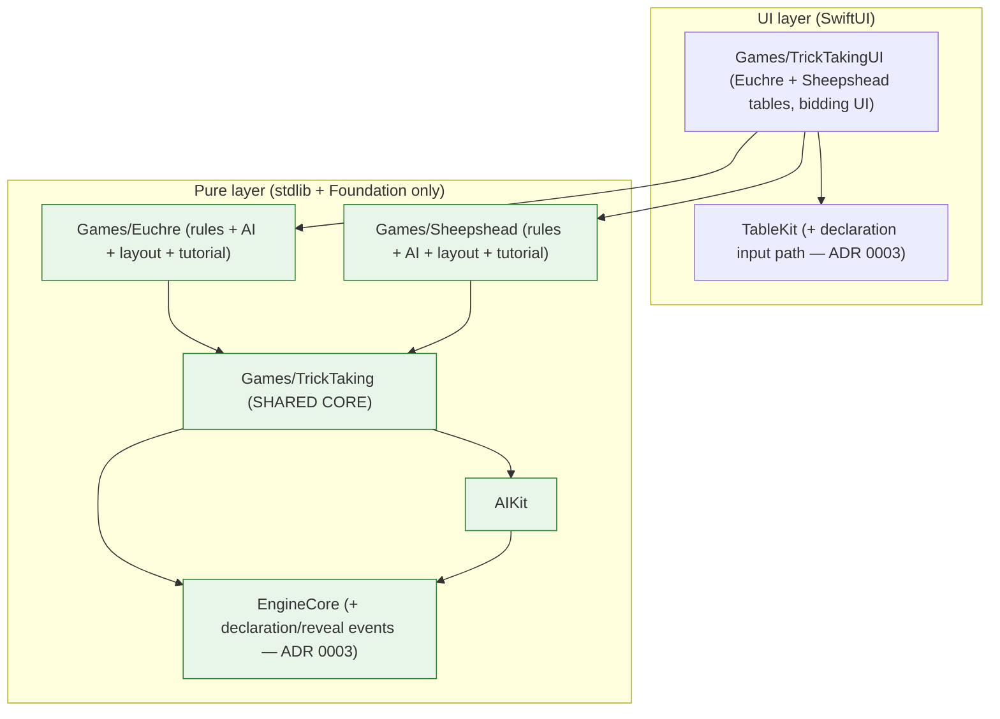

# Design — 03 Trick-Taking I (Euchre & Sheepshead)

This design realizes `requirements.md`. It is bounded by the steering documents (`product.md`, `tech.md`,
`structure.md`, `ux-guidelines.md`) and by the Spec 01 foundation (`/.kiro/specs/01-platform-foundation/
design.md`), which define the public surfaces of `EngineCore`, `AIKit`, and `TableKit`. Requirement IDs
(`R-…`, and `01:R-…` for Spec 01) are cited inline so every design element traces to an acceptance
criterion. Load-bearing decisions are recorded in **ADR 0003** (`Docs/ADR/0003-trick-taking-core.md`).

## 1. Module placement and dependency direction

The trick-taking core is a **new shared rules module** `Packages/Games/TrickTaking/` (pure: stdlib +
Foundation only), with `euchre` and `sheepshead` as rules targets that depend on it, each with the fixed
folder shape (`Rules/`, `AI/`, `Layout/`, `Tutorial/`, `Tests/`) from `structure.md`. Spec 07 (Hearts,
Spades) will depend on the **same** `TrickTaking` core **without modifying it** (Assumption A-1; R-TT-*).



The direction obeys `structure.md`: Games rules → AIKit, EngineCore; the new `TrickTaking` sits between the
per-game rules and the engine and imports nothing UI. Lint fails on any UI import inside `TrickTaking`,
`euchre`, or `sheepshead` (R-TT-6.1; `01:R-BUILD-4.3`).

## 2. The trick-taking core public contract (stable — Spec 07 depends on this unchanged)

Signatures are illustrative of the intended public surface; final names may be refined during
implementation, but the **shape and constraints are binding**, and once merged the surface is treated as a
stable contract that Spec 07 consumes without modification (R-TT-*; ADR 0003). Everything crossing the host
boundary is `Codable & Sendable` and schema-versioned (`01:R-ENG-8.5`).

### 2.1 Trump scheme, effective suit, and trick-rank (R-TT-1)

```swift
/// The trump/rank scheme a game supplies. Pure; no reference to Card identity, only faces. (R-TT-1.1)
public protocol TrumpScheme: Sendable {
    /// Whether `face` is trump given the active trump suit (nil = no-trump hands, e.g. Hearts later).
    func isTrump(_ face: CardFace, trump: Suit?) -> Bool
    /// The suit a card counts as for FOLLOWING. Differs from printed suit for e.g. the left bower. (R-TT-1.2)
    func effectiveSuit(_ face: CardFace, trump: Suit?) -> Suit
    /// A total order used only among trump cards (higher wins). (R-EUC-3, R-SHP-2)
    func trumpRank(_ face: CardFace, trump: Suit?) -> Int
    /// A total order used among cards of the same non-trump suit. (R-EUC-3.3, R-SHP-2.3)
    func failRank(_ face: CardFace) -> Int
}

/// Immutable per-trick context handed to legality/winner computations. (R-TT-1.1)
public struct TrickContext: Codable, Sendable {
    public let trump: Suit?
    public let ledEffectiveSuit: Suit?     // nil until the first card is led
    // The scheme itself is supplied by the game, not carried in Codable state.
}

public enum TrickRules {
    /// Legal plays for a hand given the led effective suit. (R-TT-1.4)
    public static func legalPlays(hand: [Card], context: TrickContext, scheme: some TrumpScheme) -> [Card]
    /// The winning (seat, card) of a completed trick. (R-TT-1.3, R-TT-2.2)
    public static func winner(of trick: Trick, trump: Suit?, scheme: some TrumpScheme) -> SeatID
    /// A typed violation naming the required suit when a follow is skipped illegally. (R-TT-1.5, R-TT-4.4)
    public static func violationForIllegalPlay(_ card: Card, hand: [Card], context: TrickContext,
                                               scheme: some TrumpScheme) -> RuleViolation?
}
```

### 2.2 Trick lifecycle (R-TT-2)

```swift
public struct Play: Codable, Sendable { public let seat: SeatID; public let card: Card }

public struct Trick: Codable, Sendable {
    public let leader: SeatID
    public private(set) var plays: [Play]      // in play order
    public var isComplete: Bool { /* plays.count == activeSeats */ }
}

/// Owns the sequence of tricks for one hand; active seats may be fewer than physical seats (loner). (R-TT-2.3)
public struct TrickPlayState: Codable, Sendable {
    public let activeSeats: [SeatID]           // clockwise from leader; excludes a sat-out partner (R-EUC-4)
    public private(set) var current: Trick
    public private(set) var completed: [Trick] // exposed for "peek at last trick" (R-TT-2.4, R-UX-3.3)
    public private(set) var trickWinners: [SeatID]
}
```

### 2.3 Partnerships (R-TT-3)

```swift
public struct SideID: Hashable, Codable, Sendable { public let raw: Int }

public enum Partnership: Codable, Sendable {
    /// Statically defined sides for the whole match (Euchre 2v2). (R-TT-3.2)
    case fixed(seatToSide: [SeatID: SideID])
    /// One picker seat, a hidden partner seat (nil until determined), the rest are defenders. (R-TT-3.3)
    case hiddenPartner(picker: SeatID, partner: SeatID?, method: PartnerMethod)
    /// A declarer of one against the rest (Euchre loner / Sheepshead go-alone). (R-TT-3.4)
    case loneDeclarer(SeatID)

    /// The side of a seat, from the CURRENT viewer's knowledge (hidden partner may be unknown). (R-TT-3.5)
    public func side(of seat: SeatID, asKnownTo viewer: Viewer) -> SideID?
}

public enum PartnerMethod: Codable, Sendable { case calledAce(Suit, rank: Rank), jackOfDiamonds, alone, unknownUnder }
```

`Partnership` is part of authoritative state and is **redacted per viewer**: a `hiddenPartner`'s
`partner` field is nil in every non-partner view until the reveal (R-TT-3.5), so the view-leak test cannot
recover it (R-QA-5.1).

### 2.4 Void / card tracking (R-TT-4)

```swift
/// Observation-derived voids: which effective suits each seat has shown it cannot follow. PUBLIC facts. (R-TT-4.1)
public struct VoidTracker: Codable, Sendable {
    public private(set) var voids: [SeatID: Set<Suit>]
    public mutating func record(seat: SeatID, ledEffectiveSuit: Suit) // called when a seat plays off-suit
    public func isKnownVoid(_ seat: SeatID, in suit: Suit) -> Bool
}
```

The tracker records a void **only** from a publicly observable event (a seat failing to follow a led suit),
so exposing it to that seat's own AI grants no hidden information — any seat could deduce the same
(R-TT-4.2; `product.md` fair play). The `DeterminizationSampler` consumes it so no sampled hand assigns a
seat a card of a suit it is known void in (R-TT-4.3).

### 2.5 Bidding / declaration framework (R-TT-5)

```swift
/// A declaration a seat can make during an auction (game supplies the concrete set). (R-TT-5.1)
public protocol Declaration: Codable, Sendable, Hashable {
    var explanation: LocalizedKey { get }     // one-line help for the UI (R-UX-1.2)
}

/// Turn-ordered auction engine reused by both games (and Spec 07). (R-TT-5.2, R-TT-5.3)
public struct Auction<D: Declaration>: Codable, Sendable {
    public let order: [SeatID]                 // turn order for the auction
    public private(set) var responses: [(SeatID, D)]
    public private(set) var current: SeatID?
    public var isComplete: Bool { current == nil }
}

/// A game supplies: the legal declarations for a seat, and how the auction terminates. (R-TT-5.1, R-TT-5.3)
public protocol AuctionRules: Sendable {
    associatedtype D: Declaration
    func legalDeclarations(for seat: SeatID, in auction: Auction<D>, hand: [Card]) -> [D]
    func advance(_ auction: inout Auction<D>, choice: D) -> AuctionOutcome<D>   // continue / finished / forced
}
```

Auction state is included in the redacted view so UI and AI see exactly the declarations a human seat would
(R-TT-5.2). Declaration and partner-reveal events are new `GameEvent` cases (ADR 0003 §A) so the caption
bar can narrate "East ordered up hearts" / "South picks" / "West is the partner" (R-TT-5.4, R-UX-2.2).

### 2.6 What Spec 07 gets for free

Hearts and Spades are trick games with different trump/partnership/scoring rules but the **same** trick
mechanics. They reuse: `TrumpScheme` (Spades: fixed trump = spades; Hearts: no-trump, `trump == nil`),
`TrickRules`, `Trick`/`TrickPlayState`, `Partnership.fixed` (Spades 2v2), `VoidTracker`, and `Auction`
(Spades bidding). No change to the core is anticipated for Spec 07; if one is needed, that is an
architecture smell requiring a new ADR (`tech.md` rule 9). This is the reuse contract ADR 0003 protects.

## 3. Game definitions built on the core

Each game conforms to `GameDefinition` (`01:R-ENG-5`) and composes the core pieces. `apply` returns events
or a `RuleViolation` (`01:R-ENG-5.4`); redaction (`01:R-ENG-8`) hides opponents' hands, the face-down kitty/
blind, and any hidden partner (R-TT-3.5).

### 3.1 Euchre state (illustrative)

```swift
struct EuchreState: GameState {
    var hands: [SeatID: [Card]]
    var turnUp: Card?                    // the up-card in bidding round 1 (R-EUC-1.3)
    var kitty: [Card]                    // 3 face-down + the (possibly picked-up) up-card
    var auction: Auction<EuchreDeclaration>   // orderUp / pass / name(Suit) / stickForced (R-EUC-2)
    var trump: Suit?
    var makers: SideID?
    var partnership: Partnership         // .fixed 2v2, or .loneDeclarer for a loner (R-EUC-4)
    var play: TrickPlayState
    var voids: VoidTracker
    var trickCounts: [SideID: Int]
}
enum EuchreDeclaration: Declaration { case orderUp, pass, name(Suit), goAlone, defendAlone }
```

Bowers are expressed purely in Euchre's `TrumpScheme`: `isTrump` returns true for the trump-suit Jack (right
bower) and the same-color Jack (left bower); `effectiveSuit` maps the left bower to the trump suit
(R-EUC-3.2, R-TT-1.2); `trumpRank` orders right > left > A > K > Q > 10 > 9 (R-EUC-3.1, R-EUC-3.3).

### 3.2 Sheepshead state (illustrative)

```swift
struct SheepsheadState: GameState {
    var hands: [SeatID: [Card]]
    var blind: [Card]                    // 2 face-down cards (R-SHP-1.3)
    var pick: Auction<SheepsheadDeclaration>  // pick / pass; then partner-call / bury (R-SHP-4, R-SHP-5)
    var picker: SeatID?
    var buried: [Card]                   // picker's 2 buried cards, points count for picker side (R-SHP-4.2)
    var partnership: Partnership         // .hiddenPartner(.calledAce/.jackOfDiamonds/.alone/.unknownUnder)
    var play: TrickPlayState
    var voids: VoidTracker
    var trickPoints: [SideID: Int]       // running card-point totals (R-SHP-3)
    var noPickResolution: NoPickOption   // leaster / doubler / forcedPick (R-SHP-7)
}
enum SheepsheadDeclaration: Declaration { case pick, pass, call(Suit), callTen(Suit), goAlone, unknownUnder, bury([Card]) }
```

Sheepshead's `TrumpScheme.isTrump` is true for every Queen, every Jack, and every diamond; `trumpRank`
encodes Q♣ > Q♠ > Q♥ > Q♦ > J♣ > J♠ > J♥ > J♦ > A♦ > 10♦ > K♦ > 9♦ > 8♦ > 7♦ (R-SHP-2.1); `failRank`
encodes A > 10 > K > 9 > 8 > 7 (R-SHP-2.3). Points come from `CardSemantics.points` (R-SHP-3).

## 4. Sequence diagram — a bidding round (Euchre order-up, illustrative of the Auction seam)

```mermaid
sequenceDiagram
    participant H as GameHost (actor)
    participant AR as AuctionRules (Euchre, pure)
    participant SC as SeatController (LocalHuman or AI)
    participant TK as TableKit (bidding UI)
    participant G as GameDefinition.apply (pure)
    H->>H: enter bidding phase; turn up top kitty card (R-EUC-1.3)
    loop each seat, left of dealer (R-EUC-2.1)
        H->>AR: legalDeclarations(seat, auction, hand)  %% orderUp/pass (round 1)
        H->>SC: decide(view incl. auction + up-card, legal)
        SC->>TK: present declarations w/ 3 input paths + one-line help (R-UX-1)
        SC-->>H: submit(declaration)
        H->>G: apply(declaration)
        alt orderUp chosen (R-EUC-2.2)
            G-->>H: trump set; dealer must discard 1; events: suitNamed, captioned
            H->>SC: dealer decide(discard)  %% still redacted per viewer
            SC-->>H: submit(discard)
            H->>H: makers recorded; auction ends
        else pass
            G-->>H: events: captioned("X passes"); advance to next seat
        end
    end
    opt all passed round 1 (R-EUC-2.3)
        H->>H: round 2 (name any suit except turned-down)
        opt all pass round 2 (R-EUC-2.4/2.5)
            alt stick-the-dealer ON (default)
                H->>SC: dealer must name a trump suit (cannot pass)
            else stick-the-dealer OFF
                H->>H: redeal by next dealer
            end
        end
    end
```

## 5. Sequence diagram — a trick (lead, follow with void detection, winner, collection, reveal)

```mermaid
sequenceDiagram
    participant H as GameHost (actor)
    participant SC as SeatController
    participant TR as TrickRules (pure)
    participant VT as VoidTracker (pure)
    participant TK as TableKit
    H->>SC: decide(view, legal = TrickRules.legalPlays(hand, context, scheme)) (R-TT-1.4)
    SC-->>H: submit(play card)
    H->>TR: validate against led effective suit (R-TT-1.5)
    alt illegal (failed to follow while able)
        TR-->>H: RuleViolation(reason names required suit)
        H-->>TK: rejected → spring-back + shake + caption; no dialog (R-UX-3.2)
    else legal
        H->>H: append play; if off-suit while suit was led:
        H->>VT: record(seat, ledEffectiveSuit) → seat void in that suit (R-TT-4.1)
        opt play reveals a hidden partner (Called Ace pulled / J♦ played) (R-TT-3.3)
            H-->>TK: pieceRevealed + partnerRevealed event; bind partner; caption (R-TT-5.4)
        end
        alt trick complete (all active seats played) (R-TT-2.2)
            H->>TR: winner(of: trick, trump, scheme) (R-TT-1.3)
            TR-->>H: winning seat
            H-->>TK: trickWon(by:) → collect center pile to winner (R-UX-2.1)
            H->>H: winner leads next trick (R-TT-2.1); update trick counts/points
        else advance to next seat
            H-->>TK: turnChanged; animate
        end
    end
```

Both diagrams are identical from `submit` onward for human and AI seats, preserving the multiplayer-ready
pipeline from Spec 01 (`01:R-SESS-1`, `01:R-SESS-4`).

## 6. AI inference approach (R-EUC-6, R-SHP-11, R-AI-*; §5 of Spec 01 AI toolkit)

All strategies receive only `(PlayerView, publicLog, legal)` — never authoritative state (`01:R-AI-1.1`).

### 6.1 Void inference (both games)
Medium and Hard read the `VoidTracker` from the view (R-TT-4.2). Determinization (`01:R-AI-2.2`) samples the
hidden hands (opponents' cards, the Euchre kitty, the Sheepshead blind) subject to constraints: known cards
removed, per-seat hand sizes correct, and **no seat assigned a card of a suit it is known void in**
(R-TT-4.3). This turns "who can still have the left bower / the case Ace" into a sampling constraint rather
than a heuristic.

### 6.2 Euchre bidding and play
- Easy: order up / call only on a hand strength above a fixed threshold (e.g. holds right bower + one other
  trump); plays the highest legal card (R-EUC-6.1).
- Medium: evaluates trump count, bowers, off-suit Aces, and seat/dealer position for bidding; in play uses
  void tracking to lead/duck and to protect the right bower (R-EUC-6.2).
- Hard: determinized **ISMCTS** over the sampled kitty and opposing hands; the information set respects
  voids and the known up-card/discard; budget per R-NFR-AI.1 (R-EUC-6.3).

### 6.3 Sheepshead partner-identity inference
The partner is hidden (Called Ace) until revealed (R-TT-3.3). Hard maintains a **belief distribution over
which defender holds the called Ace** (or J♦), updated from public evidence:
- Prior: uniform over seats that are not known void in the called suit and are not the picker.
- Update: WHEN a seat follows the called suit with a non-Ace, downweight the Ace being buried elsewhere;
  WHEN a seat is shown void in the called suit, set its probability of holding the called Ace to zero (it
  cannot legally have withheld it once the suit is led — subject to Q-SHP-8); WHEN the picker's play implies
  a called-suit holding, adjust accordingly.
- The determinization sampler draws consistent worlds weighted by this belief, and ISMCTS/Monte-Carlo
  rollouts evaluate picker-side vs defender-side lines. Easy/Medium bid on hand strength (trump count + high
  fail cards) and play straightforwardly without the belief model (R-SHP-11.1, R-SHP-11.2).

The belief model reads only public information, so it never violates fair play (`01:R-AI-1.1`); it is the
same deduction a strong human makes.

## 7. Simulation, reduced search budget, and AI-strength testing (R-QA-3, R-QA-4)

### 7.1 Reduced sim search budget (justification — R-QA-3.2)
`parlor-sim` runs many AI-vs-AI hands per game with invariants checked every step (piece conservation,
only-legal-actions, bounded length, scoring consistency incl. Sheepshead zero-sum, deterministic replay),
in **both** `make test` (fast sample) and `make test-long` (full volume) (R-QA-3.1; `01:R-QA-2`).

Running Hard at its full interactive budget (≤ 1.0 s/move, R-NFR-AI.1) across thousands of hands would make
`make test`/`test-long` far too slow. The sim therefore runs trick-taking AI at a **reduced ISMCTS/rollout
budget** (a small fixed iteration/determinization count, e.g. on the order of 1/20th of the interactive
iterations, exact numbers documented in the sim config and in `Docs/Rules` NEEDS-REVIEW-free config notes).
This is representative because the invariants under test are **budget-independent**: legality, piece
conservation, zero-sum scoring, bounded length, and replay determinism hold for *any* legal policy,
including a shallow one. The reduced budget still exercises the full decision path — determinization with
void constraints, legal-only move generation, and rollout evaluation — so it validates the code paths, not
just outcomes. Playing *strength* is not asserted by the sim; it is asserted separately (§7.2). The reduced
budget is a constant in the sim harness, not a change to the interactive budget (R-NFR-AI.1 stands).

### 7.2 AI-tier-strength statistical test (R-QA-4)
A separate, seeded test plays many hands **Hard vs Medium** and **Medium vs Easy** in each game and asserts
the stronger tier wins by a statistically significant margin. Documented parameters:
- Metric: net points per hand (Euchre match points; Sheepshead hand points), averaged over the sample.
- Sample size: a documented N per matchup (target ≈ 2,000 hands in `test-long`; a smaller smoke N in
  `test`), chosen so the expected effect is detectable.
- Significance: a one-sided test (e.g. proportion/z-test on win-rate, or a t-test on net points) at a
  documented α (e.g. 0.01); the assertion is that the stronger tier's advantage is significant, not merely
  positive.
- Reproducibility: injected seeded RNG (`01:R-AI-3.2`, R-QA-4.2) so a failure is debuggable and the test is
  not flaky. Seeds come from the seed pool (`Scripts/` seed-pool generation, Spec 01).

## 8. TableKit and UX design (R-UX-*; ADR 0003 §B)

- **Bidding/declaration UI (new TableKit input path — ADR 0003 §B).** A generic declaration panel renders
  the current `Auction`'s legal declarations from the view, each with its one-line explanation, and offers
  all three input paths plus keyboard focus (R-UX-1; `01:R-TABLE-3`). This is additive to TableKit; it does
  not change existing card input.
- **Center trick pile + collection.** The trick pile is a shared TableKit zone layout; `trickWon` drives the
  collect-to-winner animation through the existing animation queue with no per-game animation code
  (R-UX-2.1; `01:R-TABLE-1.2`, `01:R-TABLE-5`).
- **Captions and role badges.** The caption bar consumes declaration/reveal/trick events (R-UX-2.2); seat
  plates show dealer button, Euchre Maker/Alone, and Sheepshead Picker/Partner (post-reveal) badges and the
  active-turn glow / thinking indicator (R-UX-2.3; `01:R-TABLE-6.2`).
- **Legal targets, "why not," peek at last trick, history drawer.** Legal plays are highlighted while
  selecting/dragging; illegal attempts spring back with a caption from the `RuleViolation` (R-UX-3.1,
  R-UX-3.2). "Peek at last trick" reads `TrickPlayState.completed` (R-TT-2.4, R-UX-3.3).
- **End-of-hand tally (Sheepshead).** An animated count-up of each side's trick points then the payout,
  skippable and Reduce-Motion aware (R-SHP-9; `01:R-TABLE-5.3`).
- **Accessibility.** VoiceOver labels speak trump/effective suit and playability ("Jack of clubs, trump,
  playable"); bids, trump, trick wins, and partner reveals are announced; keyboard-only play covers all
  declarations; suits carry shapes and a Four-Color deck is available (R-UX-4; `01:R-A11Y-*`).
- **Physical Euchre markers (cosmetic).** The 6/4 marker display is a scoreboard rendering option only; the
  underlying scoring is unchanged (R-EUC-5.6).

## 9. Scoring design and the zero-sum invariant (R-SHP-6, R-QA-2)

Sheepshead scoring is a pure function `score(trickPoints, tricksTaken, partnership, options) -> [SeatID:
Int]`. The payout table (R-SHP-6.1) is expressed as a data table keyed by tier, with a multiplier for
double-on-the-bump (R-SHP-6.2) and a transform for go-alone (partner share folded into the picker,
R-SHP-6.3). A unit test enumerates every tier × {bump on, bump off} × {with partner, go-alone} and asserts
the payouts **sum to zero** across all 5 seats (R-SHP-6.4, R-QA-2.1). Boundary scenario tests pin 60/61,
90/91, all-tricks (schwarz), and 0-trick edges (R-SHP-6.5, R-QA-1). Go-alone defender-count/payment
adjustment is the one interpretation flagged NEEDS REVIEW (Q-SHP-9) and is implemented so that it still sums
to zero.

## 10. Determinism, purity, and testing strategy (R-TT-6, R-NFR-DET, R-QA-*)

- **Purity/determinism.** `TrickTaking`, `euchre`, `sheepshead` import only stdlib + Foundation; randomness
  is only the injected `SeededRNG` + `Shuffle.fisherYates` (ADR 0002); no wall-clock/device reads
  (R-TT-6.1, R-TT-6.2; `tech.md` rules 1, 5, 8). Same seed + log → identical final hash for a full hand of
  each game (R-NFR-DET.1, R-TT-6.3; `01:R-ENG-4.4`).
- **Scenario tests** (Swift Testing, Given/When/Then, named after the rule): Euchre bidding/bowers/alone/
  stick-the-dealer; Sheepshead pick/bury/Called-Ace + fallbacks/no-pick/every scoring tier and boundary;
  each traceable to `Docs/Rules/<game-id>.md` (R-QA-1).
- **Zero-sum + points** unit tests (R-QA-2). **View-leak** extended to a hidden Sheepshead partnership
  (R-QA-5.1). **Save/restore** at mid-bid, mid-hand, post-reveal (R-QA-5.2). **Coverage** ≥ 90% for the core
  and both rules targets (R-QA-6).
- **Sim invariants** at reduced budget in both `make test` and `make test-long` (§7.1; R-QA-3). **AI-tier
  strength** statistical test (§7.2; R-QA-4).

## 11. Following the "How to add a new game" checklist (`Docs/Architecture.md`)

1. **Rules** — `Packages/Games/Euchre/Rules/` and `Packages/Games/Sheepshead/Rules/` conform to
   `GameDefinition`, composing the shared `TrickTaking` core (§3). 2. **Deck/set** — reuse `euchre-24` and
   `sheepshead-32` `DeckDefinition`s (`01:R-ENG-2.2`) and supply each game's `TrumpScheme`/points via
   `CardSemantics`; `Card`/`Tile` untouched. 3. **AI** — Easy/Medium/Hard `Strategy` + hint per game using
   the AIKit toolkit (§6). 4. **Layout** — declarative table layouts in each game's `Layout/` (center trick
   pile, seat arrangement, bidding panel), no custom animation code. 5. **Rules doc** — author
   `Docs/Rules/euchre.md` and `Docs/Rules/sheepshead.md` (original writing), NEEDS REVIEW on §11 Open
   Questions. 6. **Catalog** — register both behind feature flags. 7. **Tests** — scenario + sim + view-leak
   + save/restore + coverage. 8. **Tutorial** — scripted deals + coach mode reusing the hint interface.
   9. **Docs upkeep** — update `Docs/Architecture.md`; **write ADR 0003** for the additive EngineCore/
   TableKit touchpoints (§12; R-NFR-DOC).

## 12. ADR 0003 summary (this spec)

**ADR 0003 — Trick-taking core and its EngineCore/TableKit touchpoints** records:
- **The stable public contract** of the `TrickTaking` core (§2), which Spec 07 reuses **without
  modification** (the reuse guarantee ADR 0003 protects).
- **Additive EngineCore change (§A):** new `GameEvent` cases for declarations and partner reveals
  (`declared`, `trumpNamed`, `pickerChosen`, `partnerRevealed`) so bidding/reveal narration flows through
  the one event stream (R-TT-5.4). Additive and schema-versioned; no existing case changes.
- **Additive TableKit change (§B):** a generic **declaration input path** (bidding panel) alongside the
  existing card input paths (R-UX-1). Additive; existing card interaction is unchanged.
- **Rationale:** both are the minimum the trick-taking family needs and are shared by Spec 07; per
  `tech.md` rule 9 any public-API change to EngineCore/TableKit requires an ADR, so this ADR is the gate.

## 13. Related documents

- `/.kiro/specs/01-platform-foundation/design.md` — foundation public surfaces this spec reuses.
- `Docs/Architecture.md` — living architecture overview (updated by this spec's tasks).
- `Docs/ADR/0001-rendering-approach.md`, `Docs/ADR/0002-rng-and-determinism.md` — reused unchanged.
- `Docs/ADR/0003-trick-taking-core.md` — introduced by this spec (§12).
- `Docs/Rules/euchre.md`, `Docs/Rules/sheepshead.md` — canonical rules (authored by this spec's tasks).
