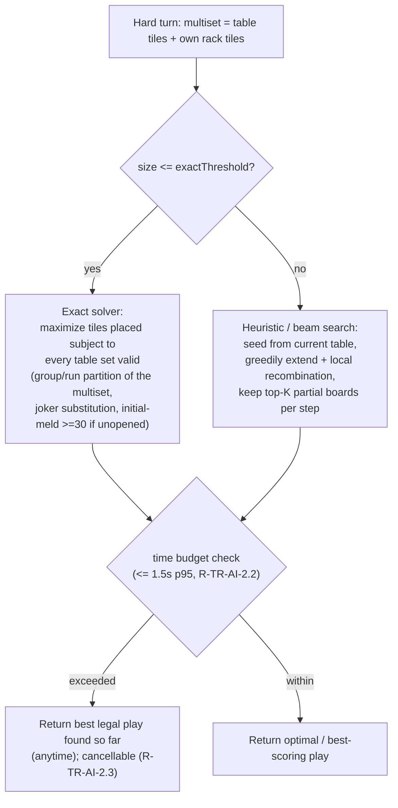

# Design — 05 Tile Rummy

This design realizes `requirements.md` for **Tile Rummy** (game id `tile-rummy`). It is bounded by the
steering documents (`product.md`, `tech.md`, `structure.md`, `ux-guidelines.md`) and by the Spec 1
platform foundation, which are authoritative. Requirement IDs (`R-TR-…` for this spec, plus inherited
`R-ENG-…`, `R-AI-…`, `R-TABLE-…`, etc.) are cited inline so every design element traces to an acceptance
criterion. The trademarked brand name for this tile-rummy family appears nowhere.

## 0. Scope and reuse posture

Tile Rummy is added as **game-specific modules only**, exactly per `Docs/Architecture.md` "How to add a
new game" (R-ENG-5.6; `structure.md`). It reuses, unchanged:

- `EngineCore` `Tile`/`TileFace`/`PieceID`, the `DeckDefinition` id `tile-rummy-106`, `Zone`/`Visibility`,
  `SeededRNG` + Fisher–Yates, `GameDefinition`/`GameHost`/`PlayerController`/`PlayerView`/`ViewToken`,
  `GameEvent`, `RuleViolation`, `Match`/`LogEntry`/`UndoPolicy` (R-TR-RULES-1, R-ENG-1/2/3/4/5/6/7/8).
- `AIKit` `Strategy` + `DeterminizationSampler`/`Evaluator`/pacing/hint interface (R-AI-*).
- `TableKit` generic renderer, declarative layout, three input paths, animation queue, HUD, and
  accessibility (R-TABLE-*).

Folder shape under `Packages/Games/TileRummy/` (`structure.md`):

```
Packages/Games/TileRummy/
  Rules/       TileRummyDefinition, State, Action, validation, scoring
  AI/          EasyStrategy, MediumStrategy, HardStrategy (+ solver), Hint
  Layout/      TileRummyLayout (declarative zones → table)
  Tutorial/    scripted deals + coach hooks
  Tests/       scenario, property, solver-correctness tests
Packages/Games/TileRummyUI/   view wiring on TableKit (no engine access)
```

> **No EngineCore/TableKit public-API change is required by this design.** Tile Rummy is expressed
> entirely with existing engine primitives and reuses the generic `GameEvent` cases (`dealt`,
> `pieceMoved`, `pieceRevealed`, `scoreChanged`, `handEnded`, `captioned`, `turnChanged`). Because no
> public API of `EngineCore` or `TableKit` changes, **no ADR is needed** for this spec (`tech.md` rule 9;
> R-NFR-DOC.2; A-TR-2). §11 explains how each rich TableKit behavior is achieved without an API change.

## 1. Game state model (Codable / Sendable, layered over the engine)

All types below live in the pure `TileRummy` rules target (stdlib + Foundation only — R-TR-NFR-7) and are
`Codable & Sendable & Hashable`, schema-versioned at the game-state boundary (R-ENG-8.5). Zones are
engine `Zone`s; the game state adds only the semantic overlay it needs.

```swift
/// The shared draw stock (hidden) and per-seat racks (owner-only) are engine Zones.
/// The table is a set of melded groups/runs, each an ordered list of tile PieceIDs.
public struct TableSet: Codable, Sendable, Hashable {
    public let id: SetID                 // stable identity for animation/rearrangement
    public var tiles: [PieceID]          // ordered (runs are low→high; groups any order)
}

public struct TileRummyState: GameState {
    public var schemaVersion: Int                        // R-ENG-8.5
    public var pool: [PieceID]                            // face-down draw stock (hidden zone)
    public var racks: [SeatID: Rack]                      // owner-only; two rows (R-TR-UX-4)
    public var table: [TableSet]                          // public shared zone
    public var hasOpened: Set<SeatID>                     // completed initial meld (R-TR-RULES-6.4)
    public var toAct: SeatID
    public var startOfTurn: TurnSnapshot                  // R-TR-TURN-1.1
    public var placedThisTurn: [PieceID]                  // tiles moved rack→table this turn (R-TR-TURN-2.1)
    public var phase: Phase
}

public struct Rack: Codable, Sendable, Hashable {
    public var main: [PieceID]                            // lower row (R-TR-UX-4.1)
    public var staging: [PieceID]                         // upper row, being arranged (R-TR-UX-4.1)
}

/// Snapshot of everything a Reset & Draw must restore (R-TR-TURN-3, R-TR-TURN-4).
public struct TurnSnapshot: Codable, Sendable, Hashable {
    public let table: [TableSet]
    public let rack: Rack                                 // the acting seat's rack at turn start
    public let poolCount: Int                             // to validate penalty-draw math
}
```

**Redaction (R-TR-NFR-5, R-ENG-8.3).** The `pool` zone is `hidden` and every non-acting seat's rack is
`ownerOnly`; in a viewer's `PlayerView` those tiles are opaque `ViewToken`s that cannot be correlated to
real identities. `table` sets are `publicAll`. Drawing from the pool emits `pieceRevealed(token,
identity)` to that seat's view only, keeping the deal animation continuous (R-ENG-8.4; R-TR-RULES-2.4).
Tile Rummy is added to the view-leak property test (R-TR-QA-4).

## 2. Actions and events

### 2.1 Actions (game-specific, Codable/Sendable)

```swift
public enum TileRummyAction: GameAction {
    case placeTiles([Placement])          // rack→table and/or table→table moves this turn
    case reclaimJoker(from: SetID, using: PieceID)     // R-TR-JOKER-1
    case sortRack(SortMode)               // .byNumber | .byRun — view-only (R-TR-UX-5)
    case endTurn                          // legal only when gated true (R-TR-TURN-2)
    case resetAndDraw                     // voluntary +1 (R-TR-TURN-3)
    case timerExpired                     // injected by host; never authored by rules (R-TR-TURN-4.4)
}

public struct Placement: Codable, Sendable, Hashable {
    public let tile: PieceID
    public let destination: Destination   // .newSet | .existingSet(SetID, index) | .rack(row)
}
```

`legalActions(for:in:)` (R-ENG-5.3) enumerates the placements available to `toAct`, and includes
`endTurn` **only** when the turn-end gate is satisfied (R-TR-TURN-2.1). `apply(_:by:to:)` returns
`(state, [GameEvent])` or a typed `RuleViolation` whose `reason` drives the spring-back caption
(R-ENG-5.4, R-TR-UX-7, R-TR-NFR-6).

### 2.2 Events — reuse only (no new engine case)

Tile Rummy maps onto the existing `GameEvent` set (R-ENG-8.1); this is why **no engine change is
required** (§0):

| Tile Rummy fact | Reused `GameEvent` |
|---|---|
| initial deal of 14 × N + pool | `dealt(pieces:)` |
| tile rack→table, table→table, or joker reclaim move | `pieceMoved(...)` (one per moved tile) |
| pool tile drawn (penalty or otherwise) becomes visible to its seat | `pieceRevealed(token:identity:)` |
| round scored | `scoreChanged(seat:delta:total:)`, then `handEnded(outcome)` |
| turn passes to next seat | `turnChanged(to:)` |
| caption narration ("East reclaimed a joker", "You reset and drew 3") | `captioned(LocalizedKey)` |

Invalid-set outlining, staging vs. main row, zoom/pan, and sort are **view state** derived in
`TableKit`/`TileRummyUI` from the `PlayerView` + event stream; they are not engine events (§11).

## 3. End Turn / Reset & Draw / timer state machine (R-TR-TURN-1..5)

At `TurnStart` the host records the `TurnSnapshot` (R-TR-TURN-1.1). The seat then arranges tiles; the
board oscillates between valid and invalid as tiles move (live outlining, R-TR-UX-2). `endTurn` is gated
by **all-sets-valid AND ≥ 1 tile placed** (R-TR-TURN-2.1). Two Reset & Draw flavors restore the snapshot:
voluntary (+1, R-TR-TURN-3) and timer-expiry-while-invalid (+3, R-TR-TURN-4.2).

```mermaid
stateDiagram-v2
    [*] --> TurnStart
    TurnStart --> Arranging : record TurnSnapshot (R-TR-TURN-1.1)
    state Arranging {
        [*] --> Invalid
        Invalid --> Valid : all sets valid (R-TR-TURN-1.2)
        Valid --> Invalid : a move breaks a set
    }

    %% End Turn gate: valid AND >=1 tile placed this turn (R-TR-TURN-2.1)
    Arranging --> EndTurnEnabled : table valid AND placedThisTurn >= 1
    EndTurnEnabled --> Arranging : further move
    EndTurnEnabled --> TurnEnd : endTurn (R-TR-TURN-2.1)

    %% Voluntary reset: available any time (esp. when idle or stuck) (R-TR-TURN-3)
    Arranging --> VoluntaryResetDraw : resetAndDraw
    EndTurnEnabled --> VoluntaryResetDraw : resetAndDraw
    VoluntaryResetDraw --> TurnEnd : restore snapshot; draw +1 (R-TR-TURN-3.1)

    %% Timer expiry (host-injected timerExpired; rules never read the clock) (R-TR-TURN-4.4)
    Arranging --> TimerCheck : timerExpired
    EndTurnEnabled --> TimerCheck : timerExpired
    TimerCheck --> TimerExpiryResetDraw : table INVALID (R-TR-TURN-4.2)
    TimerCheck --> TurnEnd : table VALID and placed >= 1  -> treat as endTurn (R-TR-TURN-4.3)
    TimerCheck --> VoluntaryResetDraw : table VALID but placed == 0 -> per Q-TR-7 (R-TR-TURN-4.3)
    TimerExpiryResetDraw --> TurnEnd : restore snapshot; draw +3 (R-TR-TURN-4.2)

    TurnEnd --> PoolCheck
    PoolCheck --> RoundEnd : seat emptied rack OR pool-exhaustion rule (R-TR-TURN-5, Q-TR-8)
    PoolCheck --> NextSeat : otherwise -> turnChanged (R-ENG-8.1)
    NextSeat --> TurnStart
    RoundEnd --> [*]
```

Guards, in words:

- **`endTurn` guard:** `tableValid(state) && !state.placedThisTurn.isEmpty` (R-TR-TURN-2.1). If false,
  `endTurn` is absent from `legalActions`; the UI shows the disabled control explained by live outlining
  (R-TR-UX-2) and, on an illegal attempt, a caption (R-TR-UX-7).
- **Voluntary Reset & Draw:** always available; restores `startOfTurn.table`/`.rack`, draws 1 from pool,
  ends the turn (R-TR-TURN-3.1). If the pool is empty, apply the pool-exhaustion rule (R-TR-TURN-5, Q-TR-8)
  without a negative-count state (R-TR-NFR-6).
- **Timer expiry:** the host injects `timerExpired`. If the table is invalid → restore snapshot + draw 3
  (R-TR-TURN-4.2). If valid with ≥ 1 placed → treated as `endTurn`. If valid but idle → resolved per
  Q-TR-7. When the timer is set to "no timer," `timerExpired` is never injected (R-TR-TURN-4.1).

## 4. Validation algorithms

### 4.1 Set validity (gates End Turn — R-TR-TURN-1.2)

```text
func isValidSet(tiles) -> Bool:
    resolved = resolveJokers(tiles)        # assign each joker a concrete (number,color); see 4.3
    if resolved == nil: return false       # no assignment makes the set legal
    return isGroup(resolved) OR isRun(resolved)

func isGroup(faces) -> Bool:               # R-TR-RULES-3
    return 3 <= faces.count <= 4
        AND allEqual(f.number for f in faces)
        AND allDistinct(f.color for f in faces)

func isRun(faces) -> Bool:                 # R-TR-RULES-4
    return faces.count >= 3
        AND allEqual(f.color for f in faces)
        AND numbers(faces) are strictly consecutive ascending
        AND min(numbers) >= 1 AND max(numbers) <= 13    # 1 is low, no wrap past 13 (R-TR-RULES-4.2)

func tableValid(state) -> Bool:            # R-TR-TURN-1.2
    return every set in state.table isValidSet
```

`resolveJokers` (4.3) turns "does a legal assignment exist?" into a small constraint check per set (a set
has at most one joker under the default option, Q-TR-5, making resolution O(1) for groups and O(run
length) for runs).

### 4.2 Initial-meld validation (R-TR-RULES-6)

The initial meld uses **only the acting seat's own rack tiles** and must total ≥ 30 with jokers counting
as the value they represent.

```text
func validateInitialMeld(placedSets, actingRack) -> Result<Int, RuleViolation>:
    # placedSets: the one-or-more sets the seat is laying down this opening (R-TR-RULES-6.3)

    # 1. Provenance: every placed tile must come from the acting seat's own rack.
    for set in placedSets:
        for tile in set.tiles:
            if tile not in actingRack (main ∪ staging):
                return .failure("Your first meld must use only tiles from your own rack")   # R-TR-RULES-6.1

    # 2. Structural legality: each placed set must be a legal group or run.
    for set in placedSets:
        if not isValidSet(set.tiles):
            return .failure("That is not a valid group or run")                              # R-TR-RULES-6.3

    # 3. Point total with jokers counting as their represented value (R-TR-RULES-6.2).
    total = 0
    for set in placedSets:
        assignment = resolveJokers(set.tiles)        # concrete number for each joker in this set
        for face in assignment:
            total += face.number                     # numbered tile = its number; joker = represented value

    # 4. Threshold.
    if total < 30:
        return .failure("Your first meld must total at least 30")                            # R-TR-RULES-6
    return .success(total)
```

On success the seat is added to `hasOpened`; only then may it rearrange existing table tiles
(R-TR-RULES-6.4, R-TR-RULES-7). Whether opening and rearranging may occur in the **same** turn is fixed by
Q-TR-6 and enforced in `legalActions`.

### 4.3 Joker resolution (R-TR-RULES-5) and reclaim (R-TR-JOKER-1)

```text
func resolveJokers(tiles) -> [ConcreteFace]? :
    numbered = tiles.filter(isNumbered)
    jokers   = tiles.filter(isJoker)
    # Try to interpret as a GROUP: shared number = the numbered tiles' number; jokers take the
    #   missing distinct colors. Valid if colors stay distinct and count in 3...4.
    # Try to interpret as a RUN: same color as the numbered tiles; jokers fill gaps or extend ends
    #   so numbers are consecutive, within 1...13, no wrap.
    # Return the first interpretation that yields a legal set; else nil.

# Reclaim: the seat plays the exact represented tile in the joker's slot.
func reclaimJoker(state, setID, tile) -> Result<...>:
    require actingSeat in state.hasOpened                                   # R-TR-JOKER-1.1
    set = state.table[setID]; represented = representedFace(of: joker, in: set)   # from 4.3
    require face(of: tile) == represented                                   # exact number+color (R-TR-JOKER-1.1)
    swap tile into the joker's slot; move joker → acting rack               # R-TR-JOKER-1.2
    require isValidSet(set.tiles)                                           # set stays valid
    # Whether the reclaimed joker must be used THIS turn or may be held: Q-TR-1 (R-TR-JOKER-1.3).
```

## 5. Scoring (R-TR-SCORE-*)

```text
func scoreRound(state) -> [SeatID: Int]:
    for seat in nonWinners:
        remaining = sum(face.number for numbered tiles in seat.rack)
                  + 30 * (count of jokers in seat.rack)          # +30 per racked joker (R-TR-SCORE-1.2)
        loserTotals[seat] = remaining
    # Winner convention is Q-TR-2 (NEEDS REVIEW): implement whichever the rules doc fixes —
    #   winner += sum(loserTotals) and/or each loser -= loserTotals[seat] (zero-sum variant).
    ...
```

Match accumulation and end condition reuse the engine `Match` model (R-TR-SCORE-2.2, R-ENG-6).

## 6. AI architecture (R-TR-AI-*)

All strategies see only `(PlayerView, publicLog, legal)` — never authoritative state (R-AI-1.1). They run
off the main actor as a cancellable `Task` with an injected `SeededRNG` (R-TR-AI-2.3, R-AI-3).

- **Easy / Medium (R-TR-AI-1.2).** Enumerate legal board extensions playable from the seat's own rack and
  take the **first** one found; if the seat has not opened, look first for a ≥ 30 initial meld
  (R-TR-RULES-6). Medium orders candidates lightly (prefer plays that shed more rack tiles) but does not
  run the Hard solver. If no legal extension exists, `resetAndDraw` (R-TR-TURN-3).
- **Hard (R-TR-AI-1.3, R-TR-AI-2).** Chooses the play that places the most tiles (ties broken by the
  evaluator: reduce rack value, keep jokers flexible). Approach:



  - **Exact small-scale solver.** When the combined multiset is small enough to solve within budget, model
    it as a maximum-tiles-placed partition of the table+rack multiset into valid groups/runs (a bounded
    DP/ILP-style search over color/number lanes with joker substitution), honoring the initial-meld
    ≥ 30 constraint when the seat has not opened (R-TR-AI-2.1). This is the classic "rearrange to place
    the most tiles" optimization.
  - **Heuristic / beam fallback.** When the board is too large to solve exactly within 1.5 s, run a beam
    search: start from the current table, greedily extend and locally recombine sets, keep the top-K
    partial boards per step, and return the best legal board found (R-TR-AI-2.1). The search is **anytime**
    and **cancellable**: on time-budget expiry or cancellation it returns the best legal play discovered so
    far (R-TR-AI-2.2, R-TR-AI-2.3).

- **Hints / coach (R-TR-AI-3).** `hint(view:)` reuses the Medium/Hard search to return a suggested action
  plus a short reason ("Play red 5-6-7 to open with 18… you need 30, add the blue 12"); coach mode reuses
  the same call (R-AI-6).
- **Correctness test (R-TR-QA-3).** Hand-crafted small boards with a known optimal placement assert the
  solver returns that optimum (and the fallback returns a legal, non-worse-than-greedy play).

## 7. Piece-conservation design note (R-TR-NFR-5)

Because 106 tiles look alike, every mutation is expressed as a **move of a `PieceID`** between exactly two
of {pool, a rack, the table}, never a create/destroy. An invariant helper `assertConserved(state)` checks
that the multiset `pool ∪ (⋃ racks) ∪ (⋃ table sets)` equals the original 106 `PieceID`s with no
duplicates and none missing. `parlor-sim` runs it after every step (R-TR-QA-2); scenario tests assert it
around Reset & Draw and joker reclaim (where tiles move between zones).

## 8. Redaction note (R-TR-NFR-5, R-ENG-8.3)

`pool` = hidden; each rack = owner-only; `table` = public. A non-owner's `PlayerView` shows pool and
opponents' rack tiles as unique `ViewToken`s that cannot be correlated to identities; a draw emits
`pieceRevealed` to the drawing seat only (R-TR-RULES-2.4). Tile Rummy is included in the view-leak
property test (R-TR-QA-4).

## 9. Save/restore (R-TR-QA-5, R-PERS-1)

`TileRummyState` — including `startOfTurn`, `placedThisTurn`, and `hasOpened` — is part of the
schema-versioned save. Restoring at any point (including mid-turn) and continuing matches an uninterrupted
run with the same seeds (R-QA-4.1), because the snapshot needed for Reset & Draw is persisted.

## 10. Testing strategy (R-TR-QA-*, R-TR-NFR-2/3)

- **Scenario tests** (Swift Testing, Given/When/Then, named after the rule they prove), traceable to
  `Docs/Rules/tile-rummy.md`: initial-meld point counting **including jokers** (R-TR-RULES-6);
  End Turn validity gating (R-TR-TURN-2); **voluntary** Reset & Draw +1 and **timer-expiry** Reset & Draw
  +3 (R-TR-TURN-3, R-TR-TURN-4); joker retrieval and its end-of-round 30-point penalty (R-TR-JOKER-1,
  R-TR-SCORE-1.2) (R-TR-QA-1).
- **Simulation invariants** in `parlor-sim`: piece conservation of all 106 tiles (R-TR-NFR-5),
  only-legal-actions, bounded length (R-TR-TURN-5.2), scoring consistency, deterministic replay
  (R-TR-NFR-2) (R-TR-QA-2).
- **AI solver correctness** on hand-crafted small boards with a known optimal play (R-TR-QA-3).
- **View-leak** property test includes Tile Rummy (R-TR-QA-4). **Save/restore** round trip incl. mid-turn
  (R-TR-QA-5). **Coverage** ≥ 90% for the rules target (R-TR-NFR-3).

## 11. TableKit reuse note (R-TR-UX-*) — no API change

Each rich behavior is achieved with the **existing** generic renderer, declarative layout, and
DesignSystem tokens; none requires a `TableKit` public-API change (§0):

- **Zoom/pan (R-TR-UX-1).** A wide-board layout hint plus standard SwiftUI `MagnificationGesture` /
  scroll-to-zoom and drag-to-pan on the table container in `TileRummyUI`; the renderer already lays out
  zones by declarative position, so panning is a container transform, not a renderer change. Reduce Motion
  swaps movement for crossfades (R-TABLE-5.3).
- **Live invalid-set outlining (R-TR-UX-2).** `TileRummyUI` derives per-set validity from the current
  `PlayerView` (via the same `isValidSet` used by the rules) and applies a **semantic warning token**
  border plus a non-color hazard style; this is view styling over existing set nodes, not a new event.
- **Multi-select / contiguous-run drag (R-TR-UX-3).** Uses TableKit's existing stack-drag path
  (R-TABLE-3.1) with a Tile Rummy selection model that groups a contiguous run into one drag payload;
  also reachable by click-place and keyboard (R-TABLE-3.2/3.4).
- **Two-tier rack (R-TR-UX-4).** The seat's rack is laid out as two declarative rows (`staging`, `main`)
  in the layout; moving a tile between rows is an ordinary `pieceMoved` within the owner-only zone.
- **Rack sort toggles (R-TR-UX-5).** `sortRack(.byNumber|.byRun)` reorders the owner-only rack view; it is
  a view/rack arrangement, does not count as placing a tile, and does not affect the End Turn gate.
- **Color + symbol tiles at S/M/L/XL (R-TR-UX-6).** Tile faces are cached vector images keyed by
  `(theme, face, scale, appearance)` (R-TABLE-2.1); each `TileColor` carries a distinct glyph baked into
  the vector face so it renders at every card size (R-A11Y-3/4).
- **Three input paths, spring-back caption, VoiceOver, keyboard (R-TR-UX-7/8/9).** All provided by
  TableKit's existing input, animation-queue, caption, and accessibility layers driven by the reused
  `GameEvent` stream and `RuleViolation` reasons (R-TABLE-3, R-TABLE-4, R-A11Y-1/2).

## 12. How this satisfies the "How to add a new game" checklist

1. **Rules** — `TileRummyDefinition: GameDefinition` (§1–§5). 2. **Deck/set** — reuse `tile-rummy-106`; no
new composition; supply tile point semantics only (R-TR-RULES-1.3). 3. **AI** — Easy/Medium/Hard + hint
(§6). 4. **Layout** — declarative `TileRummyLayout` (§11). 5. **Rules doc** — author
`Docs/Rules/tile-rummy.md` (tasks.md task 1). 6. **Catalog** — register behind a feature flag
(R-TR-DOC-6). 7. **Tests** — scenario + sim + view-leak + save/restore + coverage (§10). 8. **Tutorial** —
scripted deals + coach reusing the hint (R-TR-DOC-4). 9. **Docs upkeep** — update `Docs/Architecture.md`;
no ADR needed because no EngineCore/TableKit API changes (§0; R-NFR-DOC.1/2).

## 13. Related documents

- `/.kiro/specs/01-platform-foundation/design.md` — the foundation this design builds on.
- `Docs/Architecture.md` — "How to add a new game" checklist (§12 conforms to it).
- `Docs/Rules/tile-rummy.md` — canonical rules (authored in tasks.md task 1; resolves the Q-TR-* items).
- `Docs/ADR/0001-rendering-approach.md`, `Docs/ADR/0002-rng-and-determinism.md` — inherited rendering and
  RNG/determinism decisions. **No new ADR (0003) is introduced by this spec** (§0).
