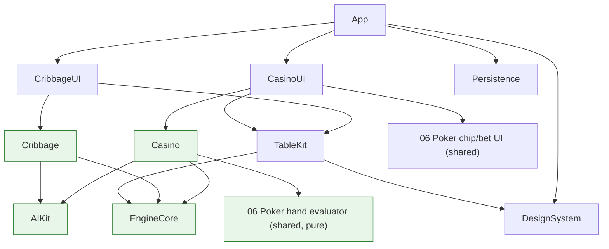

# Design — 08 Classics and Casino

This design realizes `requirements.md`. It is bounded by the steering documents (`product.md`, `tech.md`,
`structure.md`, `ux.md`), which are authoritative; where a decision is load-bearing it is recorded as an
ADR (`Docs/ADR/`) and referenced here. Requirement IDs (`R-…`) are cited inline so every design element
traces to an acceptance criterion. This spec adds **game-specific modules only** and reuses the platform
built in `01-platform-foundation` and the shared pieces built in `06-poker-room`; it does not redefine
either.

## 1. Module and target layout

Three games land in two families that `structure.md` already names, with the fixed folder shape
(`Rules/`, `AI/`, `Layout/`, `Tutorial/`, `Tests/`) (R-REUSE-3.2):

```
Packages/Games/Cribbage/                # rules target (pure: stdlib + Foundation only)
  Rules/     (CribbageDefinition, CribbageState, CribbageAction, scoring, pegging)
  AI/        (Easy/Medium/Hard strategies + hint)
  Layout/    (declarative table + peg-board layout descriptor)
  Tutorial/  (scripted deals)
  Tests/
Packages/Games/CribbageUI/              # UI target (SwiftUI; peg-board view; reuses TableKit + DesignSystem)
Packages/Games/Casino/                  # rules target (pure) — Blackjack + Video Poker
  Blackjack/{Rules,AI,Layout,Tutorial,Tests}
  VideoPoker/{Rules,Layout,Tutorial,Tests}   # single-player; no opponent AI, but has the EV hint
Packages/Games/CasinoUI/                # UI target (SwiftUI) — reuses Spec 6 chip/bet UI + TableKit
```

Dependency direction is the enforced graph from `structure.md` (arrows point to the dependency):



The Casino rules target and the poker hand evaluator are in the **pure layer** (stdlib + Foundation only,
Linux-portable, no UI frameworks — `tech.md` rule 1; R-REUSE-3.3, enforced by lint R-BUILD-4.3). The
chip/bet UI is a UI-layer component reused by `CasinoUI`/`CribbageUI`. **Adding these games requires no
changes to EngineCore or TableKit** (R-REUSE-3, `tech.md` rule 9); if implementation reveals a genuine
need, an ADR is written first (§9).

## 2. Engine design honoring the architecture rules

All three games are ordinary `GameDefinition` conformances (`R-ENG-5`). The host-authoritative,
redacted-view, deterministic, Codable-boundary architecture from Spec 1 applies unchanged:

- **Host-authoritative (`tech.md` rule 2).** The `GameHost` actor is the only mutator; the UI, AI, and
  the Video Poker single player submit actions and receive views/events. Nothing reaches into state.
- **Redacted views (`tech.md` rule 3; R-QA-VIEW-1).** Cribbage redacts the opponent's kept hand and the
  crib until it is turned for counting; Blackjack redacts the dealer hole card (and the undrawn shoe);
  Video Poker has no opponent but redacts the **undrawn deck order** so a client cannot see which cards a
  draw will produce. Hidden pieces are per-view opaque tokens rebinding on a reveal event (R-ENG-8.3/8.4).
- **Determinism (`tech.md` rule 5; ADR 0002).** One seed per hand drives EngineCore's Fisher–Yates for
  the Cribbage deck, the Blackjack shoe, and the Video Poker per-hand shuffle. Rules code never uses
  `Int.random`/`shuffle()`. Seed + action log → identical state hash (R-QA-SIM-1.1).
- **Codable boundary (`tech.md` rule 4).** All config, actions, views, events, and errors are Codable,
  Sendable, and schema-versioned. Chip amounts and bets are integer play chips carried in the Codable
  state (R-REUSE-2.2).
- **Pure rules (`tech.md` rule 1).** Scoring (Cribbage), hand resolution (Blackjack), and pay-table +
  EV evaluation (Video Poker) live in the pure rules targets; they contain no force unwraps/`try!` and
  return typed `RuleViolation`s with human-readable reasons (R-NFR-QUAL-08.1).

### 2.1 Turn models

- **Cribbage** uses a **simultaneous phase** for the discard (both players discard, then resolve;
  `R-SESS-3.2`, R-CRIB-1.7) and **sequential** turns for pegging. The starter cut, "his heels," pegging
  scores, and the show are host transitions emitting events.
- **Blackjack** is **sequential** per seat (each seat plays to stand/bust/double), then the dealer plays,
  then resolution. Insurance is an **out-of-turn window** offered to all seats on an Ace upcard before the
  peek result is revealed (`R-SESS-3.3`, R-BJ-2.2/2.3).
- **Video Poker** is a single-player two-step sequence: commit bet → deal → set holds → draw → resolve
  (R-VP-1).

### 2.2 Deck definitions (R-REUSE-4.3, R-ENG-2)

- **`standard-52`** (reused from Spec 1) for Cribbage and Video Poker.
- **`blackjack-shoe-6`** — a new `DeckDefinition` = 6× standard-52 (312 faces), each physical card a
  distinct `PieceID` (R-ENG-1.2) — added with a **composition test** asserting exactly 312 cards, 24 of
  each rank, 78 of each suit (R-ENG-2.2 pattern).
- **`CardSemantics` for Blackjack** maps 2–10 → face value, J/Q/K → 10, Ace → dual 1/11 resolved by the
  hand evaluator to the player's benefit (R-REUSE-4.3, R-BJ-3.1). Video Poker uses Spec 6's poker
  semantics via the shared evaluator (R-REUSE-1).

## 3. Reuse contract with Spec 6 (evaluator + chip/bet UI)

Spec 6 is a **prerequisite** (requirements A-1). Because Spec 6 is not yet authored, this section states
the reuse contract in terms of the **expected interface**; the concrete type names and signatures are
**NEEDS REVIEW** (Q-1, Q-2). No duplicate evaluator or chip/bet UI is designed here (`tech.md` rule 9).

### 3.1 Poker hand evaluator (for Video Poker, R-REUSE-1)

**What Video Poker needs the evaluator to expose** (expected interface — exact names NEEDS REVIEW, Q-1):

- A pure function that, given exactly 5 cards, returns a **ranked result** carrying at least:
  1. a **hand category** (royal flush, straight flush, four of a kind, full house, flush, straight, three
     of a kind, two pair, one pair, high card), and
  2. enough detail to identify the **rank of a one-pair result** (so Jacks-or-Better can be distinguished
     from a low pair — R-REUSE-1.2), e.g. the ordered kicker/rank list the evaluator already computes for
     tie-breaking.

Illustrative expected shape (subject to Spec 6's actual API — do not treat as final):

```swift
// Provided by 06-poker-room (shared, pure). Illustrative only; real signature NEEDS REVIEW (Q-1).
public enum PokerHandCategory: Int, Comparable, Codable, Sendable {
    case highCard, onePair, twoPair, threeOfAKind, straight, flush,
         fullHouse, fourOfAKind, straightFlush, royalFlush
}
public struct PokerHandRank: Comparable, Codable, Sendable {
    public let category: PokerHandCategory
    public let orderedRanks: [Rank]   // tie-break detail; for onePair, orderedRanks[0] is the paired rank
}
public func evaluate5(_ cards: [Card]) -> PokerHandRank   // exact name/location NEEDS REVIEW
```

**How Video Poker maps this to the pay table** (R-VP-2, R-REUSE-1.2): a small pure adapter in the Casino
target converts a `PokerHandRank` to a `VideoPokerPayout` category. The only category the evaluator does
not name directly is "Jacks or Better," which is derived, **not re-ranked**: `category == .onePair &&
orderedRanks[0] >= .jack → jacksOrBetter`, else `.onePair` with a low rank → `nothing`. Royal flush is
`category == .straightFlush` with the top-five ranks (or `.royalFlush` if the evaluator names it). This
adapter is the entire Video-Poker-specific ranking code; there is **no second evaluator** (R-REUSE-1.1).

**If the evaluator lacks the paired-rank detail** (Q-1 resolves negatively): the fix is a change to the
**shared** evaluator to expose it (plus an ADR — R-REUSE-1.3), not a copy in Casino. This is flagged in
tasks.md.

### 3.2 Chip and bet-sizing UI (for Blackjack and Video Poker, R-REUSE-2)

**What Blackjack/Video Poker need from the shared chip/bet UI** (expected interface — exact API NEEDS
REVIEW, Q-2):

- A **bet-sizing control** bound to a play-chip integer amount with min/max/step (Video Poker: 1–5
  credits, R-VP-1.2; Blackjack: table min/max), emitting the committed bet.
- A **chip-stack view** and a **chip-to-pot / pot-to-winner animation** driven by the same host events the
  rest of the table consumes (`R-ENG-8.1`), so payouts animate without bespoke code (R-BJ-5.5, R-VP-1.6).
- A **balance display** in play chips (no monetary affordances — R-REUSE-2.2).

`CasinoUI` composes these components; it does **not** reimplement chip stacks or bet controls
(R-REUSE-2.1). Cribbage does not bet, so it uses only the peg board (not chips). If a needed prop/callback
is missing from the shared component, the shared component is extended (+ ADR, R-REUSE-2.3), never copied.

## 4. Cribbage scoring and its exhaustive verification (R-CRIB-3, R-QA-CRIB-1)

### 4.1 The scorer

`score(hand: [Card](4), starter: Card, isCrib: Bool) -> (total: Int, breakdown: [ScoreItem])` is a pure
function (R-CRIB-3.6). It computes, over the 5-card set:

- **Fifteens:** enumerate all 2^5 − (subsets of size < 2) subsets, count those whose pip-sum (face = 10,
  Ace = 1) equals 15; 2 points each (R-CRIB-3.2).
- **Pairs:** 2 points per unordered pair of equal rank (naturally yields 6 for trips, 12 for quads).
- **Runs:** find the longest set of ≥ 3 consecutive ranks present; the run score is `length ×
  (product of the counts of each rank in the run)` — this yields double runs (×2), triple runs (×3), and
  double-double runs (×4) exactly, matching the enumerated table in `Docs/Rules/cribbage.md` (R-CRIB-3.2).
- **Flush:** if all 4 hand cards share a suit → 4, plus 1 if the starter matches → 5. **For the crib**
  (`isCrib == true`), a flush scores **only** the 5-card case (all 5 share a suit) → 5; a 4-card-only crib
  flush scores 0 (R-CRIB-3.3, R-CRIB-3.4).
- **Nobs:** +1 if the hand/crib holds the Jack whose suit equals the starter's suit (R-CRIB-3.5).

"His heels" (starter Jack → dealer +2) is a **pegging/starter** score (R-CRIB-1.5), not part of
`score(...)`, so it is excluded from the exhaustive verification (R-QA-CRIB-1.2).

### 4.2 Exhaustive verification (the 12,994,800 fact)

The independently known fact: over all ways to pick 5 distinct cards from 52 and designate one as the
starter, hand scoring yields a **maximum of 29** (achieved by exactly **4** combinations — the four
"five-fives-and-a-jack" hands: three 5s plus the fourth 5 as starter with the matching-suit Jack for
nobs), and the totals **19, 25, 26, 27 never occur** ("19" being the folk name for a zero hand)
(R-QA-CRIB-1.1).

**Combination count.** C(52,5) = 2,598,960 five-card sets × 5 choices of which card is the starter =
**12,994,800** (hand, starter) combinations (R-QA-CRIB-1.1). We iterate exactly this space.

**Compute strategy (R-QA-CRIB-1.3, Q-9).** Two-tier, so routine CI stays fast:

1. **Full brute force** (`make test-long`): iterate all 12,994,800 combinations, score each with the
   hand-flush rule (not crib), and accumulate a **histogram of scores 0…29**. Assert: `max == 29`;
   `histogram[29] == 4`; `histogram[19] == histogram[25] == histogram[26] == histogram[27] == 0`. This is
   the authoritative check and **fails loudly** (never skips) if any fact breaks (R-QA-CRIB-1.4). Expected
   runtime is seconds-to-low-minutes with a tight scorer (A-8); it runs in the long suite.
2. **Verification table** (`make test`): a `Scripts/` step runs the full brute force once and checks in a
   compact artifact — the **full 0…29 histogram** (and a digest of it) — as
   `Packages/Games/Cribbage/Tests/Fixtures/cribbage-score-histogram.json`. The fast test recomputes the
   scorer over a **deterministic representative sample** plus asserts the checked-in histogram's invariant
   facts (max 29 / count 4 / 19·25·26·27 absent). The full histogram is regenerated by the script whenever
   the scorer changes, and CI diffs it. The final placement of the full run (fast vs long) is Q-9.

This guarantees the shipped scorer reproduces the known distribution exactly, while keeping `make test`
quick.

## 5. Cribbage table and peg board (R-CRIB-6, R-DOD-2)

The Cribbage layout is a declarative zone→position descriptor like every other game (`R-TABLE-1.1`): each
player's hand, the crib, the play area (running total), and the starter. The one game-specific visual is
the **peg board**: a `CribbageUI` view rendering a physical **double-track-per-player** board (two pegs
per player; each score advances the rear peg ahead of the front by the scored amount) (R-CRIB-6.1). It is
driven by `scoreChanged` events (`R-ENG-8.1`) so pegging and counting animate through the same event
pipeline as the cards; captions narrate each score (R-CRIB-6.2). Reduce Motion swaps peg travel for a
crossfade/step (R-CRIB-6.4). The peg board and each peg carry VoiceOver labels/values (R-DOD-3.1). Whether
the peg-board view needs any new TableKit primitive is evaluated in tasks.md; the intent is that it is a
`CribbageUI`-local view over standard events, requiring **no TableKit change** (R-REUSE-3, `tech.md`
rule 9).

## 6. Blackjack design (R-BJ-*)

- **State:** the shoe (ordered undrawn cards + cut-card index), each seat's hand(s) with per-hand bet and
  status (active/stood/bust/blackjack/doubled), split lineage (up to 4 hands, R-BJ-4.1), the dealer's
  up/hole cards, and each seat's insurance bet. All Codable/Sendable.
- **Round flow (R-BJ-2):** deal two to each seat and the dealer (upcard face up, hole face down) → IF
  upcard is Ace, open the insurance out-of-turn window and resolve insurance → IF upcard is Ace or
  10-value, dealer **peeks**; insurance is resolved **before** the peek result is revealed (R-BJ-2.3) →
  if dealer blackjack, resolve immediately (player naturals push, insurance pays 2:1) → else seats act →
  dealer plays → resolve. Exact ordering/edge cases in `Docs/Rules/blackjack.md` (Q-7).
- **Player actions (R-BJ-3):** hit, stand, double (one card, double bet), split, insurance. Soft/hard
  totals computed by the Blackjack `CardSemantics` (Ace 1/11 to the player's benefit).
- **Splits (R-BJ-4):** up to 3 splits (4 hands); DAS on by default (toggle); re-split Aces under the same
  limit; split Aces get exactly one card each, no further hits, and a resulting 21 is not a blackjack.
- **Dealer + payouts (R-BJ-5):** S17 default, H17 preset; blackjack pays 3:2; win 1:1; push returns bet;
  insurance 2:1. Payouts are **exact integer play-chip arithmetic** with chip conservation asserted
  (R-QA-BJ-1.1 payout math, R-QA-SIM-1.1). The 3:2 payout uses integer math on the bet; the rules doc
  documents how odd-chip 3:2 payouts round (Q-6/rules doc), preserving conservation.
- **Shoe & penetration (R-BJ-1.3, Q-6):** reshuffle when the cut card is reached; the exact penetration
  fraction is documented and seed-reproducible.
- **Coach + Hi-Lo (R-BJ-6):** coach overlay reuses the hint interface (basic-strategy table for the
  configured S17/H17 + DAS). The Hi-Lo trainer is a **display-only** overlay computed from revealed cards;
  a test asserts toggling it changes **no** game state, action legality, payout, or shuffle timing
  (R-BJ-6.3) — it observes events but never feeds back into the host.
- **AI (R-BJ-7):** basic-strategy table lookup (fast, well under budget, R-NFR-PERF-08.4); sees only the
  redacted view; never uses the Hi-Lo count.

## 7. Video Poker design and the EV-hint algorithm (R-VP-*)

- **Flow (R-VP-1):** commit a 1–5 credit bet (reused chip UI) → shuffle a fresh 52 (seeded per hand) →
  deal 5 → toggle holds via keys 1–5 or click → draw once (replace discards from the same deck) → rank the
  final 5 with the **shared evaluator** (R-REUSE-1) → pay per the 9/6 table (R-VP-2).
- **Pay table (R-VP-2):** defined as data; the 5-credit Royal Flush is the special **4,000** bonus, all
  other rows linear in the bet; Jacks-or-Better restricted to J/Q/K/A pairs. Asserted exactly by
  R-QA-VP-1.1.

### 7.1 Optimal-hold EV hint (R-VP-3)

The hint evaluates **all 32 hold/discard subsets** of the dealt hand (2^5 = 32, R-VP-3.2) and picks the
subset with the highest expected payout, then displays it (display-only; it never auto-holds, R-VP-3.4).

For a given hold subset with `k` held cards, the draw replaces `5 − k` cards from the `47` unseen cards
(52 − 5 dealt). The exact expected value is the average payout over **all** C(47, 5−k) draw completions:

| held k | draws needed (5−k) | completions C(47, 5−k) |
|---|---|---|
| 5 | 0 | 1 |
| 4 | 1 | 47 |
| 3 | 2 | 1,081 |
| 2 | 3 | 16,215 |
| 1 | 4 | 178,365 |
| 0 | 5 | 1,533,939 |

Summed across all 32 subsets, the worst case (hold-0 dominates) is on the order of ~2.6M final-hand
evaluations per hint — each a single call into the shared 5-card evaluator plus a pay-table lookup. This
is an exact EV (no sampling).

**Live vs precomputed (R-VP-3.5, Q-8).** The design default is **live exhaustive computation** with two
guards: (1) the shared evaluator is O(1)/table-driven and fast; (2) if profiling shows the worst-case
hold-0 branch misses the interactive budget (proposed **≤ 200 ms** p95 on the M1 baseline,
R-NFR-PERF-08.3), the hint runs **off the main actor as a cancellable task** (like AI decisions,
`R-AI-3`) and/or the pay-table-relevant equivalence classes are precomputed. Because a dealt hand's EV
depends only on the multiset of held cards' ranks/suits relative to the pay table, a **precomputed table
keyed by canonicalized hand pattern** is the fallback. The chosen approach and **measured latency** are
recorded here during implementation; the budget/approach are Q-8 until measured.

### 7.2 EV-hint correctness test (R-QA-VP-1.2)

An **independent reference** brute-force EV implementation lives in the test target (A-7) — deliberately
simpler/slower and written separately from the shipping hint so the test cannot pass by comparing code to
itself. For a deterministic sample of dealt hands (seeded), the test asserts the shipping hint's chosen
hold equals the reference's EV-maximizing hold. Ties (multiple holds with equal EV) are resolved by a
documented deterministic rule (e.g. fewest cards discarded, then lowest position bitmask) applied
identically in both implementations so the comparison is well-defined.

## 8. Testing strategy (R-QA-*)

- **Scenario tests** (Swift Testing `@Test`/`#expect`), Given/When/Then, one per rule/option, named after
  the rule they prove and traceable to the rules docs (`structure.md`; `R-QA-1.1`):
  - *Cribbage* (R-QA-CRIB-2): every pegging score (15, pair, trips, quad, runs 3–7, 31, go, last card),
    heels, nobs, hand-vs-crib flush distinction, Muggins.
  - *Blackjack* (R-QA-BJ-1): S17/H17, peek+insurance timing, DAS on/off, split limits, split-Ace
    restrictions, payout math (3:2, insurance 2:1, pushes, chip conservation).
  - *Video Poker* (R-QA-VP-1): exact pay table incl. 5-credit royal bonus and J/Q/K/A restriction; EV-hint
    matches brute-force reference on a sampled set.
- **Cribbage exhaustive verification** (R-QA-CRIB-1, §4.2): full 12,994,800 brute force in `make test-long`
  asserting max 29 / exactly 4 / 19·25·26·27 absent; checked-in histogram guards `make test`.
- **`parlor-sim` invariants** (R-QA-SIM-1): shoe/deck conservation (Blackjack 312, Video Poker 52),
  only-legal-actions, bounded length, chip conservation, deterministic replay (seed + log → identical
  hash). `make test` fast sample, `make test-long` full volume.
- **View-leak property test** (R-QA-VIEW-1.1): Cribbage opponent hand + crib, Blackjack hole card, Video
  Poker undrawn deck order never leak in any serialized view (`R-QA-3.1`).
- **Save/restore round trips** (R-QA-VIEW-1.2) at random action indices for all three (`R-QA-4.1`).
- **Coverage** ≥ 90% for the Cribbage and Casino rules targets (R-QA-COV-1.1, `R-QA-7.1`).
- **UI + accessibility tests** (XCUITest): keyboard-only play of each game (Video Poker holds via 1–5 and
  H hint), VoiceOver labels for cards/chips/pegs/holds, accessibility audits (`R-A11Y-5`, R-DOD-3).
- **Performance tests** (XCTest metrics): Cribbage Hard AI decision p95 (Q-5), Video Poker EV-hint latency
  (Q-8), against the budgets in R-NFR-PERF-08.

## 9. How each game maps onto "How to add a new game"

Following `Docs/Architecture.md` and `01-platform-foundation/design.md` §11, per game:

1. **Rules** — conform to `GameDefinition` (metadata + stable kebab-case id, options schema + presets,
   initial state from seed, phases, `legalActions`, `apply` → events or `RuleViolation`, terminal/outcome,
   redaction, undo policy). Cribbage/Blackjack/Video Poker per §§4–7.
2. **Deck/set** — reuse `standard-52`; add `blackjack-shoe-6` `DeckDefinition` + composition test; supply
   Blackjack `CardSemantics`. Never edit `Card`/`Tile` (§2.2).
3. **AI** — Cribbage Easy/Medium/Hard + hint (R-CRIB-7); Blackjack Easy/Medium/Hard basic-strategy AI +
   coach (R-BJ-7); Video Poker has no opponent but ships the **EV hint** as its hint/coach (R-VP-3).
4. **Layout** — declarative layouts; Cribbage adds the peg-board view in `CribbageUI` over standard events
   (§5); Casino reuses TableKit + Spec 6 chip/bet UI (§3.2). No custom animation code beyond the peg-board
   view.
5. **Rules docs** — author `Docs/Rules/{cribbage,blackjack,video-poker}.md` (original writing); mark
   uncertain rules NEEDS REVIEW (skunks Q-4, penetration Q-6, peek/insurance Q-7).
6. **Catalog** — register `cribbage`/`blackjack`/`video-poker` behind feature flags (R-REUSE-4.2).
7. **Tests** — scenario + exhaustive + sim + view-leak + save/restore + coverage (§8).
8. **Tutorial** — scripted deals + coach reusing the hint interface (R-CRIB-8, R-BJ-8, R-VP-4).
9. **Docs upkeep** — update `Docs/Architecture.md`; **IF** any EngineCore/TableKit change or any change to
   Spec 6's shared evaluator/chip-UI public API was required, **write an ADR first** (`tech.md` rule 9;
   R-REUSE-1.3, R-REUSE-2.3, R-NFR-DOC-08.2). See §10.

## 10. Architecture Decision Records

- **ADR 0003 — Casino and Cribbage family targets and Spec-6 component reuse** (`Docs/ADR/0003-…`): records
  the target layout (Cribbage family; Casino family holding Blackjack + Video Poker), the addition of the
  `blackjack-shoe-6` `DeckDefinition`, and the **reuse contract** with Spec 6 (evaluator + chip/bet UI)
  including the rule that any needed change to a shared API is made in the shared code with its own ADR,
  never copied. This ADR is written now because it records a family/target registration decision.
- **Deferred ADRs (flagged in tasks.md, written only if triggered):** IF Spec 6's evaluator lacks the
  paired-rank detail needed for Jacks-or-Better (Q-1) → an ADR + shared-API change (R-REUSE-1.3); IF the
  shared chip/bet UI lacks a needed prop/callback (Q-2) → an ADR + shared-component change (R-REUSE-2.3);
  IF the peg board or any game needs a TableKit/EngineCore change → an ADR (`tech.md` rule 9). These are
  **not** pre-written against an unwritten API.

## 11. Related documents

- `01-platform-foundation/design.md` — platform architecture this spec builds on (host, views, RNG,
  GameDefinition, TableKit, AIKit, Persistence).
- `06-poker-room/*` (prerequisite) — source of the reused 5-card evaluator and chip/bet UI (A-1).
- `Docs/Architecture.md` — living architecture overview and the "How to add a new game" checklist.
- `Docs/ADR/0001-rendering-approach.md`, `0002-rng-and-determinism.md`, `0003-casino-cribbage-families.md`.
- `Docs/Rules/{cribbage,blackjack,video-poker}.md` — authored during implementation (original writing).
