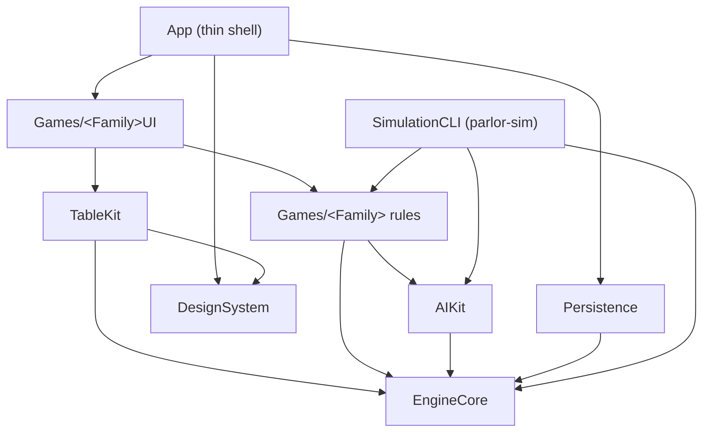

# Parlor — Architecture Overview

This is the living architecture document for Parlor. It is authoritative for how the codebase is
organized and how the pieces fit together; it is kept in sync with behavior changes in the same task that
makes them (`structure.md`; requirement R-NFR-DOC.1). The full design rationale for the current foundation
lives in `/.kiro/specs/01-platform-foundation/design.md`.

## Guiding principles

Parlor is a premium, fully offline collection of classic card and tile games for macOS. The architecture
exists to serve four things, in priority order (`product.md`): correct rules, fair play, offline privacy,
and delightful-but-legible presentation — while being **multiplayer-ready but single-player now**.

## Layered module map

Dependencies point downward; the direction is enforced by lint (`structure.md`; R-BUILD-1.4).

- **EngineCore, AIKit, and rules targets are pure** — Swift standard library and Foundation only, no
  Apple-only UI frameworks — so the same rules can run on a future Linux server (`tech.md` rule 1).
- **TableKit** consumes only EngineCore **views and events**, never authoritative state.
- **App** is a thin SwiftUI shell; the logic lives in packages so `swift build`/`swift test` run headless.

## Core concepts

- **Host-authoritative.** A `GameHost` actor is the only mutator of game state; it owns the RNG and the
  action log. Everything else submits actions and receives redacted views and events (`tech.md` rule 2).
- **Views, not state.** Each client (UI, AI, future remote) receives a `PlayerView` redacted for its
  viewer; hidden pieces are opaque, per-view tokens that cannot be correlated to real identities. A
  `pieceRevealed` event rebinds a token to its identity so animation stays continuous (`tech.md` rule 3).
- **Determinism.** The host owns a seeded PRNG and our own Fisher–Yates shuffle; the same seed plus the
  same action log reproduces an identical state hash (`tech.md` rule 5; ADR 0002).
- **Async controllers.** The turn loop awaits `PlayerController` decisions (`LocalHumanController`,
  `AIController`), so a future `RemoteController` plugs in without restructuring (`tech.md` rule 6).
- **Codable boundary.** Everything crossing the host boundary (config, actions, views, events, errors) is
  `Codable`, `Sendable`, and schema-versioned; the local UI uses this boundary exactly as a network client
  would (`tech.md` rule 4).
- **Games plug in.** A game is a `GameDefinition` + AI strategies + a table layout + a rules document + a
  catalog registration. If a game needs EngineCore/TableKit changes, that is an architecture smell and
  requires an ADR (`tech.md` rule 9).

## Rendering

SwiftUI-first table with stable card/tile identity and matched-geometry motion; vector faces cached as
images keyed by `(theme, face, scale, appearance)`; Metal shaders through SwiftUI for materials; SpriteKit
only for particle/physics overlays. See **ADR 0001**. Performance budgets are in `tech.md`; a 104-card
stress scene is the profiling harness.

## Determinism and RNG

SplitMix64-seeded xoshiro256\*\* PRNG plus our own Fisher–Yates; one seed recorded per hand; a stable
state hash proves replay determinism. See **ADR 0002**.

## How to add a new game

Adding a game is game-specific modules only, using the fixed folder shape (`Rules/`, `AI/`, `Layout/`,
`Tutorial/`, `Tests/`):

1. Conform to `GameDefinition` (metadata + stable kebab-case id, options schema + presets, initial state,
   phases, legal actions, `apply` → events or `RuleViolation`, terminal/outcome, redaction, undo policy).
2. Add a `DeckDefinition` + composition test if a new composition is needed; supply `CardSemantics` (rank
   order, points, effective suit). Never edit `Card`/`Tile`.
3. Add Easy/Medium/Hard AI strategies and a hint using the AIKit toolkit.
4. Add a declarative table layout (no custom animation code).
5. Author `Docs/Rules/<game-id>.md` (original writing); mark uncertain rules NEEDS REVIEW.
6. Register in the catalog behind a feature flag.
7. Add scenario tests per rule/option; wire into `parlor-sim`; confirm view-leak, save/restore, coverage.
8. Add a tutorial with scripted deals and coach mode (reusing the hint interface).
9. Update this document; if any EngineCore/TableKit change was required, write an ADR first.

## Architecture Decision Records

- `Docs/ADR/0001-rendering-approach.md` — rendering approach (SwiftUI-first, caching, shaders, fallback).
- `Docs/ADR/0002-rng-and-determinism.md` — PRNG algorithm, shuffle, seeds, and state hashing.

ADRs are required for new dependencies, changes to the public APIs of EngineCore or TableKit,
rendering-approach changes, and save-format changes (`structure.md`).
